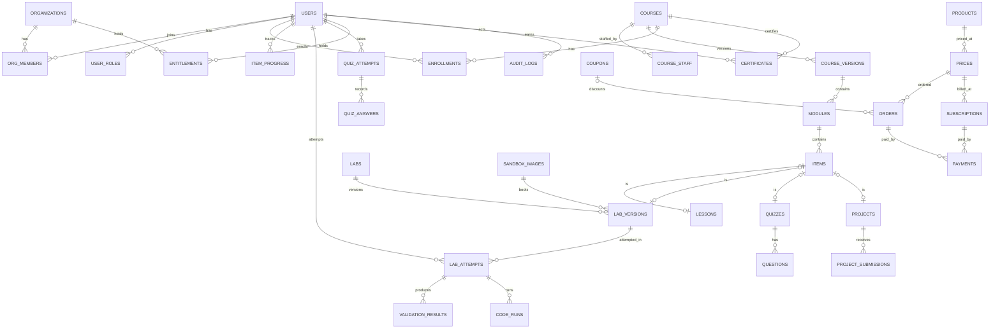

# Interactive Developer Learning Platform — System Design

Oct 1, 2026 · @Raviteja Karnati · Revised scope: terminal sandbox and compile API only, no server-side VMs

## Executive summary

Build one platform, wrap two execution engines, buy video and analytics. A **modular monolith** (Next.js + NestJS + PostgreSQL) runs everything about learning, money and people, including the thin client that talks to the code-execution services. Every lab runs on one of two **runtimes** behind a single lab engine:

- **Terminal sandbox**: a real Debian shell that runs *inside the learner's browser tab* (x86 Linux compiled to WebAssembly by CheerpX), with a file manager, guided steps and automatic checks. It works exactly like the `webvm` reference project in this workspace; section 4 specifies how to rebuild it. It uses no server compute.
- **Compile service**: Judge0 behind a `CompilerProvider` interface, for Python, Java, C, C++, Go, Rust, JavaScript, TypeScript, C#, Kotlin and SQL (SQLite). Section 5 specifies it.

**This version has no server-side virtual machines.** No Firecracker, no E2B, no Go lab platform, no scheduler. Docker labs, framework previews, real PostgreSQL labs and persistent workspaces are deferred (see *Scope of this version*). The earlier microVM design is kept in `Interactive Developer Learning Platform — System Design (microVM design, archived).md`.

The ten decisions that shape everything else:

| # | Decision | Choice | Why |
| --- | --- | --- | --- |
| 1 | System split | One LMS modular monolith; code execution is two runtimes behind one lab engine | Terminal labs need no servers, and the compile service is one isolated, replaceable dependency. A separate lab platform is not worth building yet |
| 2 | Where code runs | Terminal labs: the learner's browser (x86 Linux in WebAssembly). Compile labs: Judge0 on a server | Terminal labs cost nothing to run. Compile labs need a server-side verdict you can trust |
| 3 | Isolation | Terminal: browser and WebAssembly sandbox, no network inside the VM. Compile: Judge0's `isolate` sandbox on hosts in an isolated VPC that hold no LMS secrets | No VM fleet to run, and each runtime's blast radius stays small |
| 4 | Orchestration | No Kubernetes. ECS Fargate for the app; plain EC2 for Judge0 | Judge0 needs privileged containers, which Fargate does not allow |
| 5 | Compile compute at MVP | Hosted Judge0 behind `CompilerProvider`; self-host Judge0 CE on EC2 once volume or cost justifies it | No ops at the start, and the interface keeps the exit open |
| 6 | Lab authoring | A lab is data: versioned `lab.yaml` + starter files + a reference solution | New labs ship without a backend deploy |
| 7 | Grading trust | Compile results are server-verified and count toward certificates. Terminal checks run in the learner's browser, so they drive progress and feedback but are not certificate evidence on their own | Anything computed in the browser can be forged |
| 8 | Languages | TypeScript end to end (Next.js, NestJS, the sandbox package). No Go in this version | One language, one toolchain, one hiring profile |
| 9 | Access control | One `entitlements` table answers every "can they access this?" | Purchases, subscriptions, org seats and grants resolve to the same row shape |
| 10 | Video | Bunny Stream (or Cloudflare Stream) with signed playback; no DRM yet | HLS, transcoding and CDN for cents; labs, not video, are the product |

Two things must be settled before a paid launch: a **CheerpX commercial license** from Leaning Technologies (section 4.14), and the **Judge0 hosting choice**, hosted or self-hosted (section 5.2).

Primary region is AWS `ap-south-1` (Mumbai), since learners and payments are in India. Every cost figure in this document is an estimate in USD; section 25 states the assumptions behind them.

## Scope of this version

| Capability | Status | How it is delivered | Revisit when |
| --- | --- | --- | --- |
| Linux, bash, git, text tools | **In scope** | Terminal sandbox | — |
| Scripting at a prompt (`python3`, `sqlite3`, `gcc`, `make` preinstalled in the image) | **In scope** | Terminal sandbox | — |
| Python, Java, C, C++, Go, Rust, JavaScript, TypeScript, C#, Kotlin | **In scope** | Compile service | — |
| SQL practice on SQLite, graded | **In scope** | Compile service (Judge0's SQLite language) | — |
| Hidden-test grading and certificate evidence for code | **In scope** | Compile service | — |
| HTML/CSS live preview in an iframe | Deferred | Needs a browser-tier runtime that is not in this version | A course needs it; it is cheap to add later |
| Interactive `input()` in the browser (Pyodide) | Deferred | Compile labs take stdin up front instead | Beginner Python courses need a REPL feel |
| Docker and docker compose | Deferred | Needs a real kernel: a server VM | Revenue supports a VM tier |
| Framework labs with preview URLs (Flask, Django, Node) | Deferred | Needs a server VM and a port proxy | Same |
| Real PostgreSQL or MySQL servers | Deferred | Needs a server or a VM | A course needs locking, roles or EXPLAIN on real data |
| Kubernetes, Terraform, multi-VM networking | Deferred | Needs a server VM | Same |
| Internet access from the terminal | Deferred | The browser VM has no network | A relay with abuse controls is justified |
| Persistent workspaces, pause and resume | Deferred | Terminal sessions are ephemeral by design; an optional "save workspace" tarball is described in section 4.8 | Learners ask for multi-session projects |

## 1. Core concept: a learning loop around a real environment

Every unit of learning follows one loop: **read or watch → do it in a real environment → get checked → get feedback → move on**. Video and articles exist to set up the next action, not to be the lesson. The platform is therefore built around the environment first and the course page second.

The environment is one of two **runtimes**. A shell needs a real Linux, so it runs in the learner's browser. A coding exercise needs a trustworthy verdict, so it runs on a server. The lab author picks one in `lab.yaml`.

| Runtime | Runs where | Used for | Marginal cost | Can its result be trusted for grading? |
| --- | --- | --- | --- | --- |
| **Terminal sandbox** | The learner's browser tab. CheerpX runs 32-bit x86 Debian as WebAssembly; the disk image streams from a CDN; every change lives in a per-session IndexedDB layer that is deleted on Stop | Linux, bash, git, text tools, and scripting at a prompt (`python3`, `sqlite3`, `gcc`) | No compute. A few tens of MB of CDN egress on a learner's first launch | **Client-verified.** Good for progress and feedback; not certificate evidence on its own (section 6) |
| **Compile service** | A server. Judge0 runs one submission in an `isolate` sandbox, run to completion in seconds | Python, Java, C, C++, Go, Rust, JavaScript, TypeScript, C#, Kotlin, SQL on SQLite; hidden tests | Fractions of a cent per run (section 25) | **Server-verified** |

Two rules follow. First, a lab author picks the runtime in `lab.yaml`; the frontend and backend never special-case a technology. Second, anything that counts toward a certificate must be backed by server-verified evidence (a compile-service result, a quiz, or a reviewed project), even if the learner practised in a terminal.

## 2. Course and content model

A course is a tree of **items**, and a lesson is an ordered list of typed **blocks**. New content types are new block types registered in code and schema, never new database tables.

```text
Course
 └── CourseVersion (draft | published | archived)   ← students see a frozen published version
      └── Module (ordered)
           └── Item (ordered; kind = lesson | lab | quiz | assignment | project)
                ├── Lesson  → blocks[]  (markdown, video, image, code, editor, terminal, quiz, callout, download …)
                ├── Lab     → lab_version (see section 6)
                ├── Quiz    → questions[]
                ├── Assignment / Project → brief + rubric + submission rules
```

**Items have a `stable_key`** that survives versioning. Progress is stored against `stable_key`, so fixing a typo and republishing never resets anyone. A published version is immutable; editing creates a new draft version.

**Blocks are JSON documents** stored in `lessons.blocks` (JSONB), each shaped `{ id, type, v, data }`. A block type is a registry entry with four parts:

| Part | Lives in | Purpose |
| --- | --- | --- |
| JSON Schema for `data` | `packages/contracts` | API rejects invalid content; editor and renderer share it |
| Renderer component | `packages/content-blocks` | How students see it |
| Editor component | Same package | How instructors author it in the course studio |
| Progress contributor (optional) | API module | Whether the block gates completion (e.g. an embedded quiz must be passed) |

Adding "Mermaid diagram" or "SQL result grid" later means adding one registry entry. The `v` field lets a block type evolve; renderers migrate old versions on read.

**Interactive blocks embed labs rather than duplicating them, within one limit.** A compile `editor` block inside a lesson points at a lab version with an inline layout, so a full-page lab and a three-line "try it" snippet share one engine. A `terminal` block cannot be embedded in the lesson page: the sandbox needs cross-origin isolation, which only works on a top-level page and would break the lesson page's video player (section 4.11). A terminal block therefore renders as a card with an **Open terminal lab** button that opens the lab route.

Completion rules are per item: `required`, minimum quiz score, lab steps that must pass, project review state. Course completion is "all required items complete", evaluated server-side when any item changes state.

## 3. Lab architecture: one engine, two runtimes

The answer is **a combination**: the learner's own browser for anything with a shell, and a server-side compile API for anything that needs a trusted verdict. The platform provisions no virtual machines. Docker containers and Kubernetes pods are never used as a security boundary for student code.

### How each option scores

| Option | Isolation strength | Cost shape | Verdict |
| --- | --- | --- | --- |
| **CheerpX in the browser** (WebVM-style) | Browser and WebAssembly sandbox on the learner's machine; no network inside; cannot touch the host filesystem | Zero compute; CDN egress only | **Chosen for the terminal sandbox** |
| v86 in the browser | Same browser sandbox; open source (BSD), slower, less compatible | Zero compute | **Fallback engine** behind the same adapter interface |
| **Judge0** (managed or self-hosted) | `isolate` namespaces and cgroups with per-run CPU, wall, memory and process limits. It shares the host kernel, so the host must be disposable and hold nothing valuable | Per run (managed) or per node (self-hosted) | **Chosen for the compile service** |
| Other hosted compile APIs (Sphere Engine, JDoodle, HackerEarth) | Vendor-managed | Per execution | Drop-in alternatives behind `CompilerProvider`; compare prices before committing |
| Plain Docker containers or Kubernetes pods running student shells | Weak: one kernel bug is an escape | Servers to run | Rejected |
| Firecracker microVMs, E2B, gVisor | Strong | Servers or per-second rental | **Deferred** until a course needs Docker, a real database or a server-side shell |

Judge0's isolation is process-level, not hardware-level. That is acceptable for short, run-to-completion programs with no network, provided the Judge0 hosts live in an isolated VPC and are replaced weekly (section 9).

### Runtime per lab type

| Lab type | Runtime | Engine | Notes |
| --- | --- | --- | --- |
| Linux, bash scripting | Terminal | CheerpX, Debian 12 i386 image | Learner is the non-root `user` (uid 1000) with `sudo` inside the VM; the VM is the boundary |
| Git | Terminal | Same image with git and a seeded repository | A local bare repo at `~/remote.git` stands in for `origin`; there is no internet |
| Text processing, pipes, `grep`, `sed`, `awk` | Terminal | Same image | |
| Shell scripting with `python3`, `sqlite3`, `gcc` | Terminal | Same image | Practice-grade: x86 emulation is slower than native, so graded programs go to the compile service |
| Python, Java, C, C++, Go, Rust | Compile | Judge0 | Compile, run and hidden tests in one job; stdin is supplied up front |
| JavaScript, TypeScript, C#, Kotlin | Compile | Judge0 | Console programs only; no browser DOM |
| SQL (SELECT, JOIN, GROUP BY) | Compile | Judge0's SQLite language | Statements run against a fixture database; compare result text server-side |
| Multi-file Java or C++ projects | Compile | Judge0 "Multi-file program" with `additional_files` | The lab supplies `compile` and `run` scripts |
| Docker, frameworks with previews, real PostgreSQL or MySQL, Kubernetes | **Deferred** | Needs a server VM | See *Scope of this version* |

The Debian image is **32-bit x86, Debian 12 (bookworm)**, the last release with full i386 support. New packages must have i386 builds, and the VM cannot run Docker or any 64-bit-only software.

### The Lab Engine's internal contract

Each runtime has one narrow interface, so the UI and the rest of the platform never learn which engine is underneath. The terminal contract is the reference project's `EmulatorAdapter` (section 4); the compile contract is a server-side `CompilerProvider` (section 5).

```ts
// Terminal runtime. Runs in the browser. Contract of the reference project (`lib/emulator/types.ts`).
interface EmulatorAdapter {
  readonly name: string                              // "CheerpX 1.3.9"
  start(opts: StartOptions): Promise<void>           // resolves when a shell is ready
  write(data: string): void                          // keystrokes to the VM
  onOutput(cb: (data: string | Uint8Array) => void): () => void
  resize(cols: number, rows: number): void
  fs: VmFileSystem                                   // list, read, write, mkdir, remove, rename, archive
  exec(script: string): Promise<ExecResult>          // hidden process: checks, file manager, presets
  destroy(): Promise<void>                           // stop the VM and release every resource
  storageNames?(): string[]                          // IndexedDB databases owned by this session
}

// Compile runtime. Runs on the server; the browser never calls it directly.
interface CompilerProvider {
  languages(): Promise<CompileLanguage[]>
  run(req: RunRequest): Promise<RunResult>
  runBatch(reqs: RunRequest[]): Promise<RunResult[]> // hidden test cases
}
```

Implementations: `CheerpXAdapter` (default), `V86Adapter` (open-source fallback, experimental), `MockAdapter` (instant fake shell for UI work and tests); `Judge0Provider` (hosted and self-hosted differ only by base URL and auth header).

## 4. Terminal sandbox: build specification

This section is the build spec for the terminal runtime. The `webvm` repository in this workspace is the **reference implementation**: build the platform's sandbox from its code rather than re-deriving it, and keep its contracts even where the UI changes. File names below refer to that repository. Its own spec, `BUILD_BROWSER_LINUX_SANDBOX.md`, and its README record where reality differed from the plan; everything here has been checked against the code.

### 4.1 What the sandbox guarantees

- A **real Debian shell** in the tab: bash, coreutils, git, nano, vim, tmux, `python3`, `jq`, `gcc`, `make`, man pages. No emulated command set.
- **No per-user server compute.** The page is static; the disk image streams from a CDN.
- **Ephemeral.** The base image is read-only. Every write goes to a per-session copy-on-write layer in IndexedDB. **Stop** destroys the VM and every change; a relaunch always starts from the pristine image.
- **Offline.** The VM has no network. Git practice uses a local bare repository as `origin`.
- **Terminal plus file manager plus lessons** in one screen, with one-click commands and automatic task checks.
- **Measured launch time** (Chromium, reference machine): about 9–11 s cold and 1.7 s warm to the first prompt. Without the boot prefetch described in 4.9, a cold boot takes about 40 s.

### 4.2 Pinned stack

| Piece | Reference version | Notes |
| --- | --- | --- |
| CheerpX engine | `1.3.9`, loaded as an ES module from `https://cxrtnc.leaningtech.com/1.3.9/cx.esm.js`; `@leaningtech/cheerpx` `1.3.9` for types only | Pin the exact version. Never use "latest": the APIs below were verified against this version |
| Terminal | `@xterm/xterm` ^6.0.0, `@xterm/addon-fit` ^0.11.0, `@xterm/addon-web-links` ^0.12.0 | Browser-only; load with `ssr: false` |
| State | Zustand ^5.0.15 | Lifecycle store plus persisted view settings |
| Framework | Next.js 16.3.8, React 19.2.8, Tailwind 4 | Only the UI depends on these. The sandbox core is plain TypeScript. This Next.js version differs from older ones, so read `node_modules/next/dist/docs` before writing route or header code |
| Tests | Vitest ^5, Playwright ^1.63 | Unit tests run generated shell scripts through real bash |
| Disk image | Debian 12 i386 packed as ext2 (4 KiB blocks, about 900 MB) | Section 4.10 |

### 4.3 Architecture and contracts

```text
Browser tab (cross-origin isolated page)
├── UI (replaceable)           SandboxShell · TerminalPane · FileManagerPane · LessonsPanel · StatusBar · BootOverlay
├── Lifecycle store            launch / stop / reset; one session per tab; generation counter (lib/store.ts)
├── Session layer              uuid · Web Lock · create / boot / destroy · IndexedDB cleanup · orphan sweep (lib/session.ts)
├── EmulatorAdapter            CheerpXAdapter │ V86Adapter │ MockAdapter
│    ├── Base disk             read-only ext2 image streamed from a CDN
│    ├── Session overlay       IDBDevice "sandbox-<uuid>" under an OverlayDevice (copy-on-write)
│    ├── INBOX  /.sbx-in       DataDevice, JS → VM, in memory
│    └── OUTBOX /.sbx-out      IDBDevice "sandbox-<uuid>-bridge", VM → JS
└── fs-bridge                  VmFileSystem built on hidden shell commands (lib/fs-bridge.ts)
```

| Reference file | Responsibility | In the platform |
| --- | --- | --- |
| `lib/emulator/types.ts` | `EmulatorAdapter`, `VmFileSystem`, `VmEntry`, `ExecResult`, `VmError` | `packages/terminal-sandbox` (verbatim) |
| `lib/emulator/cheerpx-adapter.ts` | Device stack, console, hidden `exec`, `destroy` | Same package |
| `lib/emulator/cheerpx-loader.ts` | Memoised dynamic import of the pinned module; installs the IndexedDB hook first | Same package |
| `lib/emulator/idb-release.ts` | Makes session databases deletable (section 4.5) | Same package |
| `lib/emulator/output-hub.ts` | Fan-out of console output, backlog replay (up to 4096 chunks before the terminal subscribes), `waitForFirst` | Same package |
| `lib/emulator/mock-adapter.ts`, `v86-adapter.ts` | Test engine, open-source fallback | Same package |
| `lib/session.ts`, `lib/db-names.ts` | Session lifecycle, database-name parsing | Same package |
| `lib/fs-bridge.ts` | `shellQuote`, path helpers, `find` parser, `ShellFileSystem`, `SentinelCommandRunner` | Same package |
| `lib/config.ts` | Pinned version, image URL and type, VM user, shell environment | Same package, but as **parameters** instead of `NEXT_PUBLIC_*` globals |
| `lib/capabilities.ts`, `lib/prefetch.ts`, `lib/boot-manifest.json` | Browser checks, fast launch | Same package |
| `lib/store.ts` | Zustand lifecycle store and settings | `packages/lab-ui` |
| `lib/presets.ts`, `lib/lessons.ts` | Starter files, steps, task checks | **Become lab content** in `lab.yaml` (section 6) |
| `components/*` | All UI | `packages/lab-ui`; restyle freely |
| `image/Dockerfile`, `image/build-ext2.sh` | Image builder | `images/` in the monorepo |
| `scripts/serve-image.mjs`, `scripts/record-boot-manifest.mjs` | Local CDN stand-in, boot-chunk recorder | `tools/` |
| `tests/unit`, `tests/e2e` | Unit and Playwright suites | Same locations in the package |

**Contracts to keep.** The UI may look completely different if it keeps these: `EmulatorAdapter` and `VmFileSystem`; the store actions `launch`, `stop`, `reset`, `exec`, `typeInTerminal`, `setTermSize`, `bumpFs`, `focusTerminal`; and the session functions `createSession`, `bootSession`, `destroySession`, `destroySessionNow`, `cleanupOrphans`.

### 4.4 Boot sequence

1. **Capability check** (4.11): WebAssembly, cross-origin isolation, `SharedArrayBuffer`, IndexedDB. Fail early with a readable screen.
2. **`createSession`**: `crypto.randomUUID()` as the session id, then a Web Lock named `sandbox-session-<id>` held for the life of the session, then the adapter.
3. **`adapter.start({ cols, rows, onProgress, shellRc })`**, reporting these phases to the boot overlay:
   - *Loading engine* (5%): `loadCheerpX()` imports the pinned module. The import is memoised, so hovering **Launch** pre-warms it. The IndexedDB release hook (4.5) is installed before CheerpX opens any database.
   - *Connecting to disk image* (15%): build the devices below.
   - *Booting Linux* (35%): `Linux.create` with the mount table.
   - *Starting shell* (60%): register the console, hand over the rc file, start bash, and wait up to 90 s for its first output.
   - *Ready* (100%).

```ts
const base    = await CX.CloudDevice.create(IMAGE_URL)                    // or HttpBytesDevice.create(url) for any range-capable server
const idb     = await CX.IDBDevice.create(`sandbox-${sessionId}`)
const overlay = await CX.OverlayDevice.create(base, idb)                  // reads from base, writes to IndexedDB
const inbox   = await CX.DataDevice.create()                              // JS -> VM, in memory
const outbox  = await CX.IDBDevice.create(`sandbox-${sessionId}-bridge`)  // VM -> JS

const cx = await CX.Linux.create({ mounts: [
  { type: "ext2",   path: "/",         dev: overlay },
  { type: "dir",    path: "/.sbx-in",  dev: inbox },
  { type: "dir",    path: "/.sbx-out", dev: outbox },
  { type: "devs",   path: "/dev" },
  { type: "devpts", path: "/dev/pts" },
  { type: "proc",   path: "/proc" },
  { type: "sys",    path: "/sys" },
] })                                                                      // typings list fewer mount types; cast at the call site

const sendKey = cx.setCustomConsole(
  (buf: Uint8Array, vt: number) => { if (vt === 1) output.emit(new Uint8Array(buf)) },  // copy: the engine reuses its buffer
  cols, rows)

await inbox.writeFile("/sandboxrc", shellRc)   // sourced by bash via PROMPT_COMMAND just before the first prompt
await cx.run("/bin/bash", ["--login"], {       // looped: if the shell exits, print a notice and start a new one
  env, cwd: "/home/user", uid: 1000, gid: 1000,
})
```

The shell environment is `HOME=/home/user`, `TERM=xterm-256color`, `USER=user`, `LOGNAME=user`, `SHELL=/bin/bash`, `EDITOR=nano`, `LANG=C.UTF-8` and a standard `PATH`. The interactive shell adds `PROMPT_COMMAND=. /.sbx-in/sandboxrc`; hidden commands use the plain environment.

The base device depends on the image type: `cloud` uses `CloudDevice` (retrying over `https:` if the `wss:` transport fails), `bytes` uses `HttpBytesDevice` (any server with range requests), `github` uses `GitHubDevice`.

### 4.5 Behaviours verified against CheerpX 1.3.9

These are the places where the engine differs from what its documentation suggests. Rebuild the workarounds exactly.

| Assumption | Reality | What the code does |
| --- | --- | --- |
| Console input takes strings | `setCustomConsole` returns `(keyCode: number) => void` | UTF-8 encode the data and send it one byte at a time; non-ASCII input is verified |
| A resize API exists | None | Call `setCustomConsole` again with the new size; `stty size` confirms the tty updated |
| The console emits `\r\n` | It emits bare `\n` | xterm option `convertEol: true` |
| Console output is one stream | The callback also carries a virtual-terminal id | Forward only `vt === 1` |
| `deleteDatabase("sandbox-<id>")` removes session data | CheerpX names databases `cjFS_/sandbox-<id>/` and **keeps connections open after `delete()`**, so deletion blocks forever | `IDBDevice.reset()` before teardown, plus a hook that closes session connections on `versionchange` (below) |
| A persistent block cache can sit under the session layer | `OverlayDevice` over `OverlayDevice` fails to initialise | Warm starts rely on the browser HTTP cache. The `https://` CloudDevice transport fetches cacheable GETs; `wss://` is not cacheable |
| Setup commands can run before the shell | Every new binary costs seconds on a cold start | The prompt and aliases come from a builtins-only rc; preset files are created in the background while the shell boots |
| Download progress in bytes | The CDN sends no `Timing-Allow-Origin`, so cross-origin sizes read as 0 | Count image-block requests with a `PerformanceObserver` and show "N disk blocks". Add `Timing-Allow-Origin: *` on your CDN to get real sizes |

The **IndexedDB release hook** (`idb-release.ts`) patches `IDBFactory.prototype.open`. For database names that match `sandbox-<uuid>` it adds a `versionchange` listener that closes the connection, so a later `deleteDatabase` succeeds. Databases with other names are untouched, and the session Web Lock stops other tabs from deleting a live session's databases.

### 4.6 The hidden command channel

`exec(script)` runs a bash script in a **hidden process** next to the interactive shell. Nothing appears in the terminal. The file manager, lesson task checks, lab checks and preset setup all use it.

```bash
( <script>
) </dev/null >/.sbx-out/out 2>/.sbx-out/err
printf '\n__END_<id>__:%d\n' $? >>/.sbx-out/out
```

1. JS runs `cx.run("/bin/bash", ["-c", wrapped], { uid, gid, cwd, env })`. The script runs in a subshell so an `exit` inside it cannot skip the sentinel line.
2. stdout and stderr land in files on the IndexedDB-backed OUTBOX mount. JS reads them with `outbox.readFileAsBlob("/out")`, which is **binary-safe with no base64 round trip**.
3. The last line, `__END_<id>__:<status>`, carries the exit status. `<id>` is 12 random bytes in hex, so a stale file is never mistaken for a fresh result. The reader retries up to five times, with 40 ms steps, because the file may not be visible yet. stderr is read only when the status is non-zero.
4. Calls are serialised through a promise queue, so fixed file names are safe (`>` truncates them). `exec` waits for the VM to exist, so it can be called while the shell is still booting.

For engines that only expose a text stream (v86 over a serial port), `SentinelCommandRunner` does the same job over the stream: output is base64-framed between unique `__BEGIN_<id>__` and `__END_<id>__:` markers. Each marker is printed from two `printf` halves so terminal echo never shows a literal marker, and a 60 s timeout guards each command.

### 4.7 The file manager bridge

The UI sees only `VmFileSystem`. `ShellFileSystem` implements it on any `CommandRunner` (anything with `exec`), so it works with every engine.

| Operation | Command | Notes |
| --- | --- | --- |
| `list(dir)` | `find <dir> -mindepth 1 -maxdepth 1 -printf '%y\t%Y\t%s\t%T@\t%f\0'` | NUL-terminated records with the name last, so tabs and newlines in names are harmless. Directories sort first, then case-insensitive natural order. A symlink carries `linkToDir` from `%Y` |
| `read(path)` | `cat -- <path>` | Returns raw bytes |
| `write(path, data)` | Stage the bytes in the INBOX as `/upload-<random>`, then `cat -- /.sbx-in/upload-… > <path>` | The staged file is overwritten with an empty file afterwards (a `DataDevice` has no unlink). Runners without staging append 64 KiB base64 chunks |
| `mkdir(path)` | `mkdir -p -- <path>` | |
| `remove(path)` | `rm -f -- <path>`, or `rm -rf --` for folders | Refuses `/` |
| `rename(from, to)` | Exit 17 if the target exists, else `mv -T -- <from> <to>` | Refuses to move a folder into itself |
| `archive(dir)` | `tar -czf - -C <parent> -- <name>` | Downloaded as `<name>.tar.gz` |

**Rules the bridge enforces:**

- Every path reaching a shell goes through `shellQuote()`: single-quote escaping, NUL rejected, and a bare-word shortcut only for `[A-Za-z0-9_/.,:@%+=-]+` that does not start with `-`.
- `normalizePath()` accepts absolute paths only and resolves `.` and `..`. `validateName()` rejects empty names, `.` and `..`, `/`, NUL, and anything over 255 UTF-8 bytes.
- Uploads are capped at 200 MB per file; the text editor opens files up to 1 MiB.

**Behaviour to reproduce:** a lazy-loaded tree rooted at `/home/user` with a breadcrumb bar, size and modified columns, and a dotfile toggle. Buttons create files and folders, upload (picker or drag and drop onto the panel) and refresh. Drag and drop moves entries between folders. `F2` renames, `Delete` removes after a confirmation, `Enter` opens a file in the editor dialog, and any entry can be downloaded. The tree refreshes when the VM filesystem probably changed: after the learner presses Enter in the terminal and output has been quiet for 700 ms, and after every action the panel performs itself.

### 4.8 Session lifecycle

The sandbox exists only while the learner is using it. A lab session is a browser session; the server never holds a VM.

```text
idle ──launch──► booting ──ready──► running ──stop──► stopping ──► stopped
                    │                  │
                    └──── error ◄──────┘          reset = stop("reset") then launch(same lab)
```

| Rule | Behaviour |
| --- | --- |
| One session per tab | `launch` returns if the status is `booting` or `running`, and first waits for any in-flight stop |
| Generation counter | Every launch and stop increments it. A launch that finds a newer generation abandons itself and destroys what it created |
| Destroy order | Mark destroyed and reject queued commands, then `IDBDevice.reset()` on the overlay and the OUTBOX (raced against 3 s), `Linux.delete()`, delete the devices in reverse order, clear the output hub, wait 300 ms. Then delete every database named for the session, retrying once if blocked (about 5 s at most), and release the Web Lock |
| Orphan cleanup | `indexedDB.databases()` lists leftovers. Any `sandbox-<uuid>` database whose id is not in this tab's live set and has no held or pending Web Lock `sandbox-session-<id>` is deleted. It runs on the landing page, on the sandbox page, and 2 s after every stop. **This is the real guarantee**; `pagehide` cleanup is best effort |
| Tab closed without Stop | `pagehide` (not a bfcache restore) fires `destroySessionNow`, fire-and-forget. The next load sweeps whatever is left |
| Idle timeout | 30 minutes without keyboard, pointer or wheel input stops the session with reason `idle`. A warning with a countdown shows for the last 60 s. `0` disables it |
| Leaving the page | Navigating away calls `stop("navigate")` |
| Analytics | `sandbox_launch`, `sandbox_ready` (with `bootMs`), `sandbox_stop` (reason and uptime) and `sandbox_error` beacons to the platform's own endpoint |

**Optional later: save workspace.** Because the bridge already has `archive()` and `write()`, a "Save workspace" button can tar `/home/user`, upload it to S3 with a presigned PUT, and a later launch can restore it with a hidden `tar -x`. That keeps persistence on the learner's own data and adds no server compute. It is deferred, not part of the reference behaviour.

### 4.9 Making launch feel instant

A cold boot needs about 130 disk chunks, and CheerpX fetches them one at a time at roughly 300 ms each, about 40 s in total. The chunk set is fixed for a given image, so the app fetches it in parallel before CheerpX asks.

1. **On the landing or course page:** `preloadModule(CHEERPX_URL)` for the engine and `prefetchImageHead()`, which fetches the first 128 KiB of the image (a `Range` request for `bytes` images, the `?s=0&e=131071` chunk URL for `cloud` images).
2. **On hover or focus of Launch:** `prewarmEngine()` loads the module and starts `prefetchBootBlocks(preset)`.
3. **Boot manifest:** `lib/boot-manifest.json` lists the base chunks plus extra chunks per preset (for example git). They are fetched 16 at a time with `priority: "low"`, because the engine files CheerpX loads meanwhile are on the critical path. CheerpX's own requests then hit the HTTP cache or join the in-flight fetch.
4. **Show the boot overlay immediately** with the phase list and block counter, never a blank screen.
5. **Create preset files in the background** as soon as the VM exists (see 4.12), so they stream alongside the shell.

Record the manifest with `npm run build && npx next start -p 3100`, then `npm run record:manifest`. A Playwright browser cold-boots each preset with `?noprefetch=1`, collects the chunk URLs of the form `?s=<start>&e=<end>`, and writes the manifest. **Re-record whenever the image or a preset script changes.** The manifest is ignored when its `imageUrl` does not match the configured image, and `?noprefetch` disables prefetching for measurements.

> **Open risk for your own image.** The 9 s cold boot was measured on the public WebVM image over `CloudDevice`, and the manifest applies only to `cloud` images. A self-built image served over `HttpBytesDevice` does not get the manifest, so its cold boot may be much slower. Measure it early (Phase 4). If it is too slow, shrink the image, try `GitHubDevice`-style chunk files that the HTTP cache can share, or ask Leaning Technologies about `CloudDevice` hosting as part of the commercial license.

### 4.10 The disk image

**Build** (`image/Dockerfile`, `image/build-ext2.sh`):

- Base `i386/debian:bookworm-slim`, built with `--platform linux/386`.
- Docs and non-English locales are excluded to keep it small; man pages are kept because learners use `man`.
- Packages: bash, bash-completion, coreutils, util-linux, procps, findutils, grep, sed, gawk, less, man-db, git, nano, vim-tiny, tree, tmux, curl, wget, file, bc, python3, jq, zip, unzip, tar, gzip, bzip2, xz-utils, make, gcc, libc6-dev, sudo, locales. Drop `gcc libc6-dev` (about 150 MB) if no course uses C in the terminal.
- A non-root `user` account (uid and gid 1000, the ids the app runs as) with passwordless `sudo` inside the VM, hostname `sandbox`, a coloured prompt, and a system-wide git identity so commits work offline.
- Lessons are copied to `/home/user/lessons`.
- `build-ext2.sh <version> <size>` streams `docker export` into a helper container that runs `mkfs.ext2 -q -b 4096 -L sandbox -d /rootfs`, so owners and permissions survive on Windows and macOS hosts. It seeds `resolv.conf`, `hosts` and `hostname`, then runs `e2fsck -fn`. Output is `out/rootfs-<version>.ext2`; a 900 MB image is the reference size.
- Never put secrets in the image: anyone can download it.

**Images are immutable and versioned.** Always bump the version when anything changes (`rootfs-v1.ext2`, `rootfs-v2.ext2`), because the file is cached as immutable and an in-place update would mix old and new blocks. The platform keeps a `sandbox_images` record per version (slug, version, CDN URL, image type, size, SHA-256), and each lab version pins one. Use one image per course family (for example `linux-git`, `data-tools`) rather than one giant image: every block a learner touches is downloaded on first launch, so a lean image launches faster.

**Host it on a CDN, not with the app.** Requirements:

| Requirement | Header or setting |
| --- | --- |
| Range requests | `Accept-Ranges: bytes`, and `Range:` answered with `206` |
| CORS | `Access-Control-Allow-Origin` for your site; expose `Content-Range`, `Content-Length` and `Accept-Ranges` |
| Cross-origin isolation | `Cross-Origin-Resource-Policy: cross-origin`, because the lab page sends COEP `require-corp` |
| Caching | `Cache-Control: public, max-age=31536000, immutable` |
| Progress sizes (optional) | `Timing-Allow-Origin: *` so the boot screen can show real megabytes |

Cloudflare R2 (custom domain, CORS policy, and a response-header transform rule for CORP and cache headers) and S3 with CloudFront (forward `Origin` and `Range`, add a response-headers policy for CORP) both work. R2 has no egress fees, which matters for an image streamed to every learner (section 25). Check with `curl -sI -r 0-1023 -H "Origin: https://your-site" <image-url>`: expect `206`, `Content-Range`, the CORS header and the CORP header.

**Test locally:** `npm run serve:image` serves `image/out` with range requests, CORS and CORP; point `NEXT_PUBLIC_IMAGE_URL` at it. Acceptance: the VM boots and `git --version; python3 --version; tree --version; jq --version; tmux -V` all succeed.

The default public WebVM image (Debian buster, no `tree`, `jq` or `tmux`) is for evaluation only. Production must use your own image.

### 4.11 Cross-origin isolation and where the sandbox lives

CheerpX needs `SharedArrayBuffer`, which needs the page to be cross-origin isolated: `Cross-Origin-Opener-Policy: same-origin` and `Cross-Origin-Embedder-Policy: require-corp`, served over HTTPS (or localhost). That has consequences for a platform that is more than one page:

| Constraint | Consequence | Platform decision |
| --- | --- | --- |
| COOP `same-origin` severs `window.opener` | OAuth popup sign-in (Google, GitHub) breaks on an isolated page | Sign-in and checkout stay on non-isolated routes |
| COEP `require-corp` blocks cross-origin subresources that lack CORP or CORS | Cross-origin iframes (the video player, Razorpay checkout), third-party scripts and web fonts are blocked unless they send CORP or CORS headers themselves, which you do not control | Isolate **only** the terminal lab route: `/labs/terminal/*`. Everything else stays non-isolated |
| An iframe can be isolated only if its top-level page is | A terminal cannot be embedded inside a normal lesson page | The terminal is a **top-level page**. Lessons link to it |
| Analytics scripts are third-party | They are blocked by COEP on the lab route | Send first-party beacons to your own endpoint from the lab route; no PostHog JS and no session replay there |

Scope the headers to the lab route (verify the `headers()` syntax against the Next.js docs bundled in `node_modules/next/dist/docs` for your version):

```ts
// next.config.ts
async headers() {
  return [{
    source: "/labs/terminal/:path*",
    headers: [
      { key: "Cross-Origin-Opener-Policy", value: "same-origin" },
      { key: "Cross-Origin-Embedder-Policy", value: "require-corp" },
    ],
  }];
}
```

The reference applies the headers to `/(.*)` because it is a single-purpose app. On a static export or another host, set the same headers in `vercel.json` or a Netlify/Cloudflare `_headers` file for the same path. Acceptance: `window.crossOriginIsolated === true` on the lab route.

**The lab route runs third-party code in your origin.** The CheerpX script is loaded from Leaning Technologies' CDN and executes with full page privileges. Keep the session cookie `HttpOnly`, keep no tokens in `localStorage` on this route, restrict `script-src` with a CSP, and ask Leaning about self-hosting the build under the commercial license so you control the bytes.

**Capability check** (`checkCapabilities`): WebAssembly, `window.crossOriginIsolated`, `SharedArrayBuffer`, IndexedDB. Each check has a help string; a failing check renders a full-page "unsupported browser" explanation instead of a broken terminal. The sandbox is desktop-first: Chrome, Edge and Firefox on desktop are supported; Safari is untested; a coarse-pointer small screen gets a dismissible "built for desktop" notice.

### 4.12 UI behaviour to reproduce

The look is yours; these behaviours are what "works exactly like the reference" means.

- **Launch entry:** preset or lab chosen on the course page; capability chips; the Launch button pre-warms on hover and focus; a small-screen hint.
- **Sandbox screen:** a status bar (state pill, lab name, session id, **Stop** and **Reset**), a resizable side panel (240–640 px, default 340) with **Files**, **Steps** (the reference's *Lessons*) and **Cheat sheet** tabs, the terminal filling the rest, and a footer with shortcuts and the idle warning.
- **Terminal:** xterm.js with a blinking block cursor, `lineHeight` 1.2, 5,000 lines of scrollback, `convertEol: true`, a `FitAddon` driven by a `ResizeObserver` on `requestAnimationFrame`, and a refit once web fonts load. Links open in a new tab with `noopener,noreferrer`. **Ctrl+Shift+C/V** copy and paste (Ctrl+C stays SIGINT); **Ctrl+\`** focuses the terminal from anywhere. Every resize is forwarded with `adapter.resize` (4.5).
- **View settings** persisted in `localStorage` (never required for correctness): three terminal themes (midnight, amber, paper), font size 10–24, side-panel width, dotfile visibility, active tab.
- **Boot overlay:** the phase list from `onProgress`, a progress bar, and the "N disk blocks" detail.
- **Steps panel:** step text supports `inline code` and **bold**. A step with a `cmd` shows a **Run** button that types the command plus Enter into the terminal (`typeInTerminal(cmd, true)`); the terminal takes focus. A step with a task shows its goal and a **Check** button that runs the check through `exec`: status 0 is a pass.
- **Presets (starter content):** a `workspaceScript` runs as a hidden command, as the normal user, in the background the moment the VM exists: `exec('cd "$HOME" || exit 1\n' + script)`. The status bar shows "Adding … files" until it finishes, then the file tree refreshes. The reference presets are Linux basics, Git playground (a repo with history, a feature branch and a local bare `origin`), Bash scripting, and Blank.
- **Shell rc:** sourced once before the first prompt via `PROMPT_COMMAND` (then unset). It uses **bash builtins only**, because each new binary costs seconds on a cold start. It sets the coloured `PS1`, aliases (`ll`, `la`, coloured `ls` and `grep`) and a default `~/.gitconfig` if none exists.

### 4.13 Testing

- **Unit (Vitest):** `shellQuote` and the generated scripts run through **real bash**, the `find` output parser, path helpers, session and orphan cleanup logic, and the preset scripts.
- **End to end (Playwright):** a `mock` project against `?engine=mock` (instant fake shell, fast and offline) and a `vm` project against real Linux (needs network). The core test: launch, type `echo hi`, expect `hi`, create a file through the panel, `cat` it, Stop, relaunch, and confirm the file is gone.
- **Measure:** time to first prompt, cold and warm, and memory after 10 minutes. Re-measure whenever the image changes (4.9).

### 4.14 Licensing and engine risk

- **CheerpX is not free for a commercial platform.** Its public deployment is free for individuals; use by organizations (including non-profits and education), and hosting the CheerpX build yourself, require a commercial license from Leaning Technologies (sales@leaningtech.com). Get a quote, including the terms for self-hosting the script, before the paid beta. Budget it as a line item; no price is published.
- **v86 is the exit.** It is BSD-licensed, runs the same `EmulatorAdapter` contract, and is already stubbed in the reference as an experimental adapter. It needs a guest image with a shell on `ttyS1` and is slower. Keep the adapter interface clean so the swap stays possible.
- **CheerpX API drift.** The workarounds in 4.5 are version-specific. Re-verify them, and re-run the full test suite, before bumping the pinned version.

### 4.15 Porting plan

1. Create `packages/terminal-sandbox` (framework-free TypeScript) from the files marked "Same package" in 4.3, turning the `NEXT_PUBLIC_*` constants into constructor parameters (image URL and type, engine, user, environment, idle timeout, analytics endpoint). Keep the unit tests.
2. Add the React components and the Zustand store to `packages/lab-ui`; restyle to the platform design system.
3. Add the route `/labs/terminal/[attemptId]` as a client-only page (`ssr: false` for xterm), with the scoped COOP/COEP headers from 4.11.
4. Create `images/linux-git/` from `image/`, build and verify the image, upload it to the CDN, add a `sandbox_images` row, and record the boot manifest.
5. Express presets and lessons as terminal `lab.yaml` files (section 6). Compile each check type to a bash script (section 6) and run it with `exec`.
6. Add the server side: create an attempt, and accept client-reported step results with `source = client` (section 29).
7. Run the acceptance checklist below.

**Acceptance checklist**

- [ ] Runs fully in the browser; no per-user server compute.
- [ ] Launch shows a bash prompt with a progress indicator; warm launch takes a few seconds.
- [ ] xterm.js terminal: colours, resize, copy and paste, `vim` and `nano` work.
- [ ] `git`, bash scripting, coreutils, `grep`/`sed`/`awk`, `tmux` and `python3` are available.
- [ ] File manager: browse, create, rename, delete, move, upload, download, edit.
- [ ] Stop destroys the session; relaunch is pristine; orphaned session databases are removed on the next load.
- [ ] `EmulatorAdapter` abstraction lets CheerpX and v86 be swapped.
- [ ] The lab route sends COOP/COEP, the image CDN supports range requests and CORP, and `crossOriginIsolated` is `true`.
- [ ] A clear error screen appears for unsupported browsers.
- [ ] Step checks run through `exec` and tick live; client-reported results reach the server flagged `source = client`.

## 5. Compile service: Judge0 behind `CompilerProvider`

The compile service runs short, run-to-completion programs and returns a verdict. It is the only place untrusted code executes on a server in this version, so it is small, isolated and replaceable.

### 5.1 Request flow

```text
Browser ──HTTPS──► LMS API ──► auth · entitlement · rate limit · cache ──► CompilerProvider ──HTTPS + token──► Judge0
                      ▲                                                                                       │
                      └───────────── verdict, stdout, stderr, time, memory (hidden test detail stripped) ◄────┘
```

- The **browser never calls Judge0**. Only the LMS API does, so learners cannot submit arbitrary code at your cost, hidden tests never leave the server, and results are recorded before they are shown.
- **Run** (practice) is one submission with the learner's own stdin. **Check** (graded) is a batch: one submission per test case, compared server-side.
- The LMS worker **polls** Judge0 for batch results with a short backoff (300 ms, growing to 1 s). It does not use `callback_url`, so Judge0 never needs a route back into the core network.

### 5.2 Hosting options

| Option | Fit | Notes |
| --- | --- | --- |
| **Hosted Judge0** (Judge0's managed service, or Judge0 CE on RapidAPI, which offers a free Basic plan) | **MVP** | No servers, no kernel tuning. Check current plans and rate limits before relying on them |
| **Self-hosted Judge0 CE on EC2** | Once the hosted bill passes about two nodes' cost (section 25), or for data residency | You own patching and scaling. Details below |
| Another hosted compile API (Sphere Engine, JDoodle, HackerEarth) | Alternative | Implement `CompilerProvider` for it and compare per-execution pricing. The platform treats all of them the same |

**Self-hosting requirements.**

- **Privileged containers.** Judge0 needs `--privileged` or `SYS_ADMIN` plus access to `/sys/fs/cgroup`. **ECS Fargate cannot run it**; use EC2 with Docker Compose.
- **cgroup v1 on Judge0 1.13.x.** Newer distributions default to cgroup v2, where the sandbox fails with "No such file or directory" errors for `/box/...`. Use a host image or boot parameter that selects cgroup v1, and re-check this against the Judge0 release you deploy.
- **Components:** the API server, one or more workers, PostgreSQL and Redis. At MVP all four run on one instance with Docker Compose; later PostgreSQL moves to RDS and Redis to ElastiCache.
- **Licence:** Judge0 is GPL-3.0. You call it over HTTP as a separate service, so your own code is not affected; confirm with counsel.
- **Version and CVEs:** Judge0 has had published sandbox-escape advisories before (fixed in 1.13.1, 2024). Pin a patched release, subscribe to its security advisories, and never run an old image.

### 5.3 The `CompilerProvider` contract

```ts
interface RunRequest {
  language: string                       // platform slug, e.g. "python3"; mapped to a Judge0 language_id
  files: { path: string; content: string }[]  // one file -> source_code; several -> Multi-file program + additional_files zip
  stdin?: string
  args?: string                          // command-line arguments (Judge0 limit: 512 chars)
  limits: { cpuSeconds: number; wallSeconds: number; memoryMiB: number; maxProcesses?: number; maxOutputKiB?: number }
}

interface RunResult {
  verdict: "accepted" | "wrong_answer" | "time_limit" | "compile_error" | "runtime_error" | "internal_error"
  stdout: string
  stderr: string
  compileOutput: string
  exitCode?: number
  timeMs: number
  memoryKiB: number
  providerRef: string                    // Judge0 submission token, for support and audit
}
```

**Mapping to Judge0.**

| Platform field | Judge0 field |
| --- | --- |
| `files` (single) | `source_code`, `language_id` |
| `files` (several) | Language "Multi-file program" (id 89) with a Base64 `additional_files` zip that contains the lab's `compile` and `run` bash scripts |
| `stdin`, `args` | `stdin`, `command_line_arguments` |
| `limits.cpuSeconds` | `cpu_time_limit` (seconds), with `cpu_extra_time` as grace |
| `limits.wallSeconds` | `wall_time_limit` (seconds) |
| `limits.memoryMiB` | `memory_limit` (kilobytes, an **address-space** limit) |
| `limits.maxProcesses` | `max_processes_and_or_threads` |
| `limits.maxOutputKiB` | `max_file_size` (kilobytes), plus truncation in the provider |
| Always | `enable_network: false`; no `callback_url` |

**Status mapping.** Judge0 status 3 is accepted, 4 wrong answer, 5 time limit exceeded, 6 compilation error, 7–12 runtime errors (by signal), 13 internal error and 14 exec-format error; 1 and 2 mean the submission is still queued or running. Status 13 and 14 map to `internal_error` and are **never counted against the learner**: the LMS retries once and then shows "platform error, try again".

**Compare output in the LMS, not in Judge0.** Submit without `expected_output` and compare stdout in TypeScript, so the comparison mode is yours: trim trailing whitespace per line, optional float tolerance, optional order-insensitive lines, and a clear diff for the first failing public case.

### 5.4 Run and Check

| | Run | Check |
| --- | --- | --- |
| Purpose | Practice: see output | Graded: pass or fail per test case |
| Input | The learner's stdin from the stdin box | Test cases from the lab package, kept server-side |
| Judge0 calls | One submission | One batch (`POST /submissions/batch`), polled to completion |
| What the learner sees | stdout, stderr, compile output, exit code, time and memory | Per-case verdict. Hidden cases show only the case name and pass or fail. The first failing **public** case also shows input, expected and actual |
| Recorded | `code_runs` row | `code_runs` rows plus `validation_results` with `source = server` |
| Cached | Yes: results keyed by a hash of language, files, stdin and limits are kept for 10 minutes, so repeated clicks cost nothing | No |

### 5.5 Limits, languages and abuse controls

Starting limits per run, tuned per lab and language in `lab.yaml`:

| Limit | Default | Why |
| --- | --- | --- |
| CPU time | 2 s (Java, Kotlin, C#: 5 s) | JVM and .NET start-up eats the budget |
| Wall time | 5 s (managed languages: 10 s) | Stops programs that sleep or block |
| Memory | 256 MiB (Java, Go, Node: 512 MiB or more) | Judge0's limit is on **address space**, and these runtimes reserve far more than they use, so tune on real programs |
| Processes and threads | 32 | Contains fork bombs inside the run |
| Output | 64 KiB, truncated | Stops output floods |
| Source and stdin | 64 KiB each, enforced by the LMS | Bounds request size |

**Languages.** Judge0 language IDs differ between versions. Store a `compile_languages` snapshot (platform slug, Judge0 id, label, enabled) taken from `GET /languages` at deploy time; labs reference slugs only. Initial set: Python 3, Java, C, C++, Go, Rust, JavaScript (Node), TypeScript, C#, Kotlin, SQLite, plus Multi-file program.

**Rate limits** (Redis counters per user and per IP; numbers are starting points):

| Action | Limit |
| --- | --- |
| Run | 10 per minute, 200 per day on the free plan |
| Check | 5 per minute per lab |
| Queue admission | If the Judge0 queue is above the cap, return `429` with a retry hint and a "busy, retrying" message rather than letting latency grow without bound |

A signed-in, entitled learner is required for every call; anonymous runs are not offered.

### 5.6 Self-hosted topology

| Stage | Topology |
| --- | --- |
| MVP | Hosted Judge0. Or one 4 vCPU / 8 GiB EC2 instance running API, worker, PostgreSQL and Redis with Docker Compose, in a private subnet of the compile VPC, reachable only from the LMS API's security group |
| 1,000 active | Two nodes (one spare), still Docker Compose or two small stacks behind an internal load balancer |
| 10,000 active | Three or more worker nodes, RDS for Judge0's PostgreSQL, ElastiCache for its queue, an internal ALB for the API |
| 100,000+ | An auto scaling group of workers driven by queue depth, multiple API nodes, and a hosted provider kept as overflow behind the same interface |

Judge0 is configured with an auth token, a maximum queue size, no per-request network access, and ceilings on every limit so a request cannot exceed your maximums (see Judge0's configuration reference for the exact settings). Hosts are built from an AMI and replaced weekly; nothing persists on a worker.

### 5.7 UI contract for compile labs

- Editor with multi-file tabs, read-only scaffold regions and a stdin box. There is **no interactive input**: a program that reads input receives the stdin box's contents up front. Design lessons accordingly, and use the terminal sandbox's `python3` for ungraded interactive practice.
- Output panel with separate stdout, stderr and compile-output tabs, the exit code, wall time and memory.
- Test results with a per-case verdict and a diff for public cases.
- **Run** (Ctrl/Cmd+Enter) and **Check** (Ctrl/Cmd+Shift+Enter), disabled while a request is in flight.

## 6. Lab validation engine and lab spec

A lab is a **package of data**: a `lab.yaml` spec, starter files, step instructions in Markdown, and a reference solution. Checks are typed declarations. Instructors never need a backend deploy to ship a lab.

### Lab package

```text
git-branches-101/                    two-sum/
├── lab.yaml                         ├── lab.yaml
├── files/        # seed files       ├── files/main.py        # starter code
├── steps/01.md, 02.md               ├── steps/01.md
├── checks/       # optional scripts ├── tests/               # hidden cases: 01.in, 01.out, …
└── solution.sh   # one function     └── solution/main.py     # reference solution
                  # per step
```

### A terminal lab

```yaml
apiVersion: labs/v1
kind: Lab
metadata: { slug: git-branches-101, title: Git branches, tags: [git], difficulty: beginner }
runtime:
  type: terminal
  image: linux-git:3                  # resolves to a sandbox_images row (CDN URL, type, SHA-256)
  user: user                          # uid 1000, home /home/user, as in the reference image
  limits: { idleTimeoutMinutes: 30 }
  network: none                       # the VM has no network
shell:
  rc: ./shell.rc                      # optional; bash builtins only
init:                                 # runs hidden in the background once the VM exists
  - run: git init -q -b main ~/project && cd ~/project && git commit -q --allow-empty -m "initial"
ui: { layout: terminal, cwd: /home/user/project }
steps:
  - id: create-branch
    title: Create a branch called feature/login
    instructions: ./steps/01.md
    cmds:                             # become Run buttons
      - git switch -c feature/login
    checks:
      - type: git.branch_exists
        repo: ~/project
        branch: feature/login
        fail: "No branch named feature/login yet. Run `git branch` to list branches."
    hints:
      - "Branches are created with `git branch <name>` or `git switch -c <name>`."
      - "Try: git switch -c feature/login"
  - id: commit-on-branch
    title: Make one commit on it
    instructions: ./steps/02.md
    checks:
      - { type: git.commit_count, repo: ~/project, ref: feature/login, base: main, min: 1 }
      - { type: git.clean_worktree, repo: ~/project }
solution: ./solution.sh
```

### A compile lab

```yaml
apiVersion: labs/v1
kind: Lab
metadata: { slug: two-sum, title: Two Sum, tags: [python, arrays], difficulty: beginner }
runtime:
  type: compile
  language: python3                   # platform slug, mapped to a Judge0 language id
  limits: { cpuSeconds: 2, wallSeconds: 5, memoryMiB: 256 }
files:
  - { path: main.py, template: ./files/main.py, editable: true }
ui: { layout: editor-output }
steps:
  - id: solve
    title: Print the indices of the two numbers that add up to the target
    instructions: ./steps/01.md
    checks:
      - type: program.io
        compare: { trim: lines, ordered: true }
        cases:
          - { name: sample, stdin: "4\n2 7 11 15\n9\n", stdout: "0 1\n", hidden: false }
          - { name: negatives, stdin: ./tests/02.in, stdout: ./tests/02.out, hidden: true }
          - { name: large, stdin: ./tests/03.in, stdout: ./tests/03.out, hidden: true }
    hints:
      - "A hash map from value to index gives an O(n) solution."
solution: ./solution/main.py
```

The same format covers both runtimes; only `runtime.type`, `ui.layout` and the check families differ.

### Check types

| Family | Examples | Runtime | How it is evaluated |
| --- | --- | --- | --- |
| File | `file.exists`, `file.contains` (regex), `file.mode`, `dir.matches_tree` | Terminal | Compiled to `test` and `grep` commands and run through `exec` |
| Git | `git.branch_exists`, `git.current_branch`, `git.commit_count`, `git.commit_message_matches`, `git.merged`, `git.no_conflict_markers`, `git.clean_worktree` | Terminal | Compiled to `git` plumbing commands (`rev-parse`, `rev-list --count`, `status --porcelain`) |
| Command | `command.exit_code`, `command.output_matches` | Terminal | Runs the check's own command, not the learner's |
| Process | `process.running` | Terminal | `pgrep` or `/proc` inspection. There is no network in the VM, so no port or HTTP checks |
| SQLite CLI | `sql.result_equals`, `sql.schema_has`, `sql.row_count` | Terminal | Runs `sqlite3` against a file in the VM |
| Shell history | `shell.ran` ("used grep") | Terminal | Needs `PROMPT_COMMAND='history -a'` in the lab's shell rc (a builtin, so no extra process). A weak signal; never the only check |
| Script | `script.custom`: an instructor bash script that prints `{"passed": bool, "message": str}` | Terminal | Run with `exec` and a 10 s timeout |
| Program I/O | `program.io` with stdin cases and expected stdout | Compile | One Judge0 submission per case, compared in the LMS |
| SQL | `sql.result_equals` against a fixture database | Compile | The statement runs in Judge0's SQLite language; stdout is compared in the LMS |
| Test harness | `tests.harness`: a hidden test file injected next to the learner's code | Compile | Uses the Multi-file program language; only runners that exist in your Judge0 environment work (for example Python `unittest`), so verify before promising `pytest` or JUnit |
| Seeded challenge | `challenge.answer`: the learner finds a value in the terminal and submits it in a form | Terminal, **server-verified** | See the trust model below |

**Terminal checks are pure functions.** Each family is a TypeScript function `compileCheck(check): string` that returns a bash script (exit 0 means passed). That keeps checks unit-testable the same way the reference tests its scripts: run the generated bash through real bash against a fixture. A new check family is a new function in the sandbox package, not a backend deploy.

### How a check runs

**Terminal lab**

1. The learner clicks **Check**, or a cheap watch check fires after the terminal settles (the same 700 ms quiet period that refreshes the file tree), so steps tick live.
2. The browser compiles each check to bash and runs it with `adapter.exec` (a hidden process, 10 s timeout).
3. The browser shows the result and posts `{ stepId, checkId, passed, details }` to the LMS. The server validates that the step belongs to the lab version, records it with `source = client`, and advances progress. The server cannot re-run the check.

**Compile lab**

1. The learner clicks **Check**. The browser sends the files and the step id to the LMS API.
2. The LMS loads the hidden cases, runs them through `CompilerProvider.runBatch`, compares the output, records `validation_results` with `source = server`, and returns per-case verdicts.
3. The browser only displays results; it never reports them.

### Trust model

The learner owns the terminal sandbox. They can `touch` a file, edit the page's JavaScript, or post a forged result. Terminal results are therefore **client-verified**: honest for learning, not proof for a certificate.

| Evidence | Where it runs | Counts toward certificates? |
| --- | --- | --- |
| Compile-service checks | Server | Yes |
| Quizzes, reviewed projects | Server, or a human | Yes |
| Seeded terminal challenge | Browser, with a server-verified answer | Yes |
| Other terminal checks | The learner's browser | Progress and feedback only |

A **seeded challenge** closes the gap for terminal labs. When the attempt starts, the server issues a random `seed`. The lab's `init` script derives its dataset from the seed (for example, generating a log file where the number of failed logins depends on the seed). The learner solves the task in the terminal and submits the answer in a form outside the terminal. The server computes the expected answer from the seed with a pure function and compares. A classmate's answer is useless because seeds are per attempt; the only way to pass is to solve the task, or to run the same analysis locally, which is also learning.

Rules that follow:

- A course's certificate rules (section 22) must name only server-verified items as required. Terminal labs may be required for **completion** but are labelled "self-verified" in the learner's record.
- The check scripts and `init` scripts ship to the browser, so a determined learner can read them. Never put secrets or answer keys in a lab package that reaches the terminal runtime. Compile-lab test cases never leave the server.

### Authoring without backend changes

- The Lab Builder (sections 14–16) edits this spec through forms and exports it as a zip. Power users can upload YAML directly.
- Every published lab version is immutable and must pass **Lab CI**:
  - *Terminal labs*: a headless Chromium boots the real sandbox (the reference's Playwright `vm` project does exactly this), asserts every check fails on the initial state, runs `solution.sh` one step at a time through `exec`, asserts each step's checks pass, and records the timing.
  - *Compile labs*: run the starter code and assert the checks fail, run the reference solution through Judge0 and assert every case passes, and record the time and memory.
- **Reset to step N** (terminal): relaunch from the pristine image, then run `solution.sh` steps 1 to N−1 hidden, so a stuck learner can skip ahead without redoing everything. **Reset lab** just relaunches.
- Hints are tiered. Each reveal is logged, which feeds "most difficult step" analytics and later an AI hint that sees the step, the failed check's message and the recent commands.
- A new check family is a TypeScript function in the sandbox package (terminal) or a comparison mode in the compile module. `script.custom` covers the long tail meanwhile.

## 7. Browser experience

One `LabShell` component renders every lab. It reads `ui.layout` from the lab spec and arranges a fixed set of panels; a new technology reuses the same panels with a different arrangement.

### Layouts

| `ui.layout` | Panels | Runtime | Used by |
| --- | --- | --- | --- |
| `terminal` | Side panel (Files, Steps, Cheat sheet) │ Terminal; status bar and footer | Terminal | Linux, Git, bash, text tools |
| `editor-output` | File tabs + editor │ Output with stdin; test results drawer | Compile | Python, Java, C, C++, Go, Rust, SQL on SQLite |
| `inline` | Compact editor with Run, inside a lesson | Compile | "Try it" blocks |

`terminal` is always a **top-level route** (`/labs/terminal/[attemptId]`) because of cross-origin isolation (section 4.11). Lessons that contain a terminal lab show an **Open terminal lab** card instead of an embed. Layouts for a live HTML preview, a SQL result grid and a three-pane editor, terminal and preview split are deferred with the runtimes that need them.

### Reusable components (`packages/lab-ui`)

| Component | Built on | Key behaviour |
| --- | --- | --- |
| `Terminal` | xterm.js with fit and web-links addons | Fed directly by the in-browser adapter; there is **no WebSocket**. Resize, copy and paste, themes (section 4.12) |
| `FileManager` | Custom tree on `VmFileSystem` | The reference behaviour in section 4.7: create, rename, move, delete, upload, download, edit |
| `StepsPanel` | Rich-text renderer | Steps with Run buttons, live ✓ / ○ state from check results, task goal and Check button |
| `CheatSheet` | Static groups | Navigate, files, search and text, git, processes; per-lab override |
| `BootOverlay`, `StatusBar`, `UnsupportedBrowser` | Custom | Boot phases and block counter, state pill with Stop and Reset, capability failure screen |
| `CodeEditor` | Monaco | Multi-file tabs, per-language diagnostics, read-only regions for scaffold code, autosave |
| `SnippetEditor` | CodeMirror 6 | Lightweight editor for inline lesson blocks and mobile, where Monaco is heavy |
| `OutputPanel` | Custom | Separate stdout, stderr and compile output, stdin box, exit code, time and memory |
| `TestResults` | Custom | Per-case pass or fail, diff view for public cases |
| `HintDrawer` | Custom | Tiered reveal, logs each reveal |
| `LabControls` | Custom | Check, Run, Reset (lab or to step N), Hint, Next; disabled states while a request runs |
| `SessionStatus` | Custom | Idle countdown for terminals, "platform busy, retrying" for compile |

### Client architecture

- The **terminal** keeps its own Zustand store from the reference (lifecycle, terminal size, `fsVersion`, `focusToken`). The lab shell wraps it with a `LabSession` store that holds step states and results, so the panels subscribe to slices.
- A `LabTransport` interface has two implementations: `BrowserSandboxTransport` (wraps an `EmulatorAdapter`) and `CompileTransport` (HTTPS calls to the LMS API). Panels talk to the transport and never learn which one is behind it.
- **Editor labs** autosave to IndexedDB immediately and to the server every 5 s and on Check, so a refresh never loses work. **Terminal labs** keep no workspace: the sandbox is ephemeral by design. Step results are the only thing saved, and the learner can relaunch and replay.
- Labs are desktop-first. On phones, lessons, quizzes and compile snippets work; terminal labs show a "continue on a laptop" handoff with a resume link.
- Keyboard: Ctrl/Cmd+Enter runs, Ctrl/Cmd+Shift+Enter checks; in the terminal, Ctrl+Shift+C/V copy and paste, and Ctrl+\` returns focus to it. The terminal traps keys only while focused, so screen-reader users can leave it.

## 8. Technology evaluation

TypeScript end to end for the product and the sandbox package, Judge0 for compilation, PostgreSQL as the one system of record. Each choice below is judged on security, scale, cost, development speed and maintenance for a small team.

### Frontend

| Technology | Verdict | Reason |
| --- | --- | --- |
| Next.js (App Router) + React + TypeScript | **Use** | Server-rendered catalog and course pages for SEO; client-only lab routes |
| Tailwind CSS | **Use** | Fast, consistent; shared tokens in `packages/ui` |
| CheerpX (WebAssembly x86 emulator) | **Use** for the terminal sandbox | Real Debian in the tab with no server compute. Commercial license needed (section 4.14) |
| v86 | **Keep as fallback** | Open source; slower; behind the same adapter |
| xterm.js | **Use** | The standard browser terminal; same as VS Code's |
| Monaco | **Use** for full compile labs | VS Code editing model; about 2–3 MB, so lazy-load it on lab routes only |
| CodeMirror 6 | **Use** for inline snippets and mobile | Small and touch-friendly |
| WebSockets | **Not needed for labs** | The terminal runs in the browser and compile calls are request and response. Use SSE or one socket for notifications only |
| WebRTC | **Skip** | Only useful for future pair programming or live video |
| TanStack Query + Zustand | **Use** | Server state and lab client state respectively |

### Backend

| Option | Strengths | Weaknesses | Verdict |
| --- | --- | --- | --- |
| **NestJS (Node.js, TypeScript)** | Module system maps to a modular monolith; DI, guards and interceptors fit RBAC and audit; shares types and Zod schemas with Next.js | Heavier than plain Express; needs discipline to keep modules decoupled | **LMS core and the compile module** |
| Plain Node.js (Fastify, Hono) | Light and fast | You rebuild module boundaries, DI and conventions yourself | Fine, but NestJS gives structure a growing team needs |
| FastAPI (Python) | Great for ML-heavy work | A second language across the core with no shared types | **Not now.** Add a small Python service only if AI features need Python-only libraries |
| Go | Static binaries, low memory, excellent for proxies and daemons | A second language, and nothing in this version needs it: there is no gateway, scheduler or in-VM agent | **Deferred** until a self-hosted VM fleet exists |

For data access in NestJS, use **Drizzle ORM** with SQL-first migrations. It keeps PostgreSQL features (JSONB, partial indexes, generated columns, partitioning) first-class. Validate every request body with Zod schemas from `packages/contracts`.

### Data stores

| Store | Role | What it holds |
| --- | --- | --- |
| **PostgreSQL** (RDS) | System of record | Users, orgs, courses, versions, lessons (JSONB), labs and lab versions, sandbox image records, compile languages, enrollments, progress, quizzes, payments, subscriptions, entitlements, certificates, audit logs, learning events (partitioned), search index (initially) |
| **Redis / Valkey** (ElastiCache) | Fast, disposable state | Session cache, entitlement cache, rate-limit counters, compile-result cache, idempotency keys |
| **S3** | Blobs | Course assets, attachments, lab bundles, project uploads, certificate PDFs, analytics exports |
| **Object storage + CDN for sandbox images** | Read-only, immutable, range-requested | The Debian ext2 images (Cloudflare R2 or S3 with a CDN) |

Judge0, when self-hosted, keeps its own small PostgreSQL and Redis inside the compile VPC. They hold submissions only and are never connected to the LMS database.

## 9. Infrastructure architecture and security model

Only one thing runs hostile code on your servers: the compile service. Keep it behind a hard wall, in a separate VPC (preferably a separate AWS account), so that a sandbox escape lands on a host that holds nothing of value. The terminal sandbox runs on the learner's machine and adds no server attack surface, only a few client-side risks covered below.

```text
┌─ Edge ──────────────────────────┐   ┌─ Core (trusted) ─────────────────────┐   ┌─ Compile (untrusted) ────────────┐
│ CloudFront · WAF · Next.js web  │   │ NestJS API + worker · PostgreSQL ·   │   │ Judge0 API + workers (EC2)       │
│ Lab route /labs/terminal (COOP/ │──►│ Redis · S3 content buckets           │──►│ Judge0 PostgreSQL + Redis        │
│ COEP) · Image CDN (read-only)   │   │ Holds all business data and secrets  │   │ Holds submissions only           │
└─────────────────────────────────┘   └──────────────────────────────────────┘   └──────────────────────────────────┘
   learner's browser runs the                 the only path across the wall:  LMS API ──HTTPS + token──► Judge0
   terminal sandbox (WebAssembly)             (results come back in the response; nothing calls the core from outside)
```

The system has three trust zones:

1. **Edge**: CloudFront, WAF, the Next.js web app, the isolated lab route, and the image CDN. The image CDN serves public, read-only, immutable files.
2. **Core (trusted)**: the NestJS monolith, worker, PostgreSQL, Redis and S3 content buckets. Holds all business data and secrets.
3. **Compile (untrusted)**: Judge0 hosts, with their own small database and queue. Holds no business data.

**One narrow path crosses the wall:** the LMS API (or worker) calls Judge0 over HTTPS with a secret token, from the core's security group to the compile VPC's private endpoint. Judge0 cannot open connections back to the core, because the worker polls for results instead of using callbacks. If a hosted Judge0 is used, the same path exists over the public internet, with the provider's key.

| Concern | One shared account | Separate compile VPC or account |
| --- | --- | --- |
| Blast radius of a sandbox escape | Database, secrets, sessions | A Judge0 host holding no LMS credentials |
| Scaling | Compile spikes starve the API | Compile scales on its own hosts and metrics |
| Instance types | One compromise for both | Privileged-container EC2 hosts for Judge0; small Fargate tasks for the app |
| Deploy cadence | Host patches restart the product | Judge0 hosts roll weekly without touching the LMS |
| Cost visibility | Compile spend hidden in app spend | Per-account billing shows compile cost per student |
| Complexity | Lower at first | One extra VPC and one internal endpoint; worth it from day one |

### Threats and controls

| Threat | Runtime | Control |
| --- | --- | --- |
| Forged terminal results | Terminal | Terminal checks are client-verified by design. Certificate evidence must be server-verified; seeded challenges cover terminal labs (section 6) |
| Learner's code escaping the sandbox | Terminal | It runs in the learner's own browser sandbox and WebAssembly. It cannot reach the host filesystem except files the learner explicitly uploads, and the VM has no network |
| Third-party script in your origin | Terminal | CheerpX loads from a vendor CDN into the lab route. Pin the version, set a CSP, keep tokens out of JS-readable storage, avoid putting anything sensitive on the lab route, and pursue a self-hosted build under the commercial license |
| Malicious or tampered disk image | Terminal | Images are built in CI from reviewed Dockerfiles, scanned (Trivy), uploaded under immutable versioned names, and recorded with a SHA-256. Serve them only over HTTPS from your own CDN. No secrets inside |
| Leftover session data in the browser | Terminal | Per-session IndexedDB names, Web Lock, orphan sweep on every load (section 4.8) |
| Upload and filename injection | Terminal | `shellQuote()` for every path, `validateName()`, 200 MB cap (section 4.7) |
| Outbound abuse, reverse shells, mining pools | Terminal | The VM has no network at all |
| Sandbox escape on Judge0 | Compile | Isolated VPC with no peering to the core; hosts hold no LMS credentials; weekly AMI replacement; pinned, patched Judge0 release; watch security advisories |
| Direct abuse of the Judge0 API | Compile | Judge0 is reachable only from the LMS security group and requires an auth token; the browser never calls it |
| Fork bombs, memory and CPU hogs | Compile | Per-run CPU, wall, memory and process limits; output cap; a fork bomb only exhausts its own run |
| Outbound abuse, SSRF, cloud metadata | Compile | `enable_network: false` on every run; the learner supplies no URLs and no `callback_url`; hosts use IMDSv2 with hop limit 1 and an IAM role with no permissions beyond logs |
| Cryptomining | Compile | No network blocks pools; CPU and wall limits cap the damage; sustained limit-hit patterns from one account trigger throttling and a flag |
| Request-flood cost attacks | Compile | Per-user and per-IP rate limits, queue admission cap, size limits on source and stdin, entitled sign-in required |
| Hidden tests exposed | Compile | Cases stay server-side and only per-case verdicts return; hidden cases never show input or expected output |
| Student JS attacking the app | Both | Terminal runs in WebAssembly with no DOM access; compile output is rendered as text, never as HTML |
| Abuse at signup scale | Both | Compile and terminal labs need a verified email; free plans get lower run limits |
| Neighbour attacks | Compile | Each run gets its own `isolate` box that is destroyed afterwards; no shared filesystem between runs |

### Network policy for Judge0 hosts

```text
ALLOW  LMS API security group → judge0-api:2358        (HTTPS via internal load balancer; token required)
ALLOW  judge0-api ↔ judge0-db/redis                    (inside the compile VPC)
ALLOW  host → package/image mirrors and logging        (VPC endpoints; no general internet)
DROP   everything else, including all egress from submissions
```

### Destroy by default

Nothing a learner runs is kept. Terminal sessions are destroyed on Stop and swept on the next load. Each compile run's `isolate` box is destroyed when the run ends, and Judge0 hosts are replaced from a fresh AMI at least weekly. Submissions older than 30 days are purged from Judge0's database; the LMS keeps only verdicts, timings and the learner's own saved code.

## 10. Cloud infrastructure by scale

No Kubernetes at any stage below. The app is a few containers on ECS Fargate; the compile service is a few EC2 hosts (or a hosted provider). The terminal sandbox needs no compute at all, only a CDN.

### Which AWS services are actually needed

| Service | Needed? | Role |
| --- | --- | --- |
| CloudFront | Yes | CDN for web, assets and private downloads (signed URLs); terminates TLS near users |
| WAF | Yes, from launch | Managed rule sets, bot control on auth routes, per-IP rate limits |
| S3 | Yes | All blobs (section 18) |
| ECS on Fargate | Yes | API and worker |
| EC2 | When Judge0 is self-hosted | Judge0 hosts (privileged containers; Fargate cannot run them) |
| EKS | **No** | Nothing here needs it |
| Lambda | Barely | Optional for S3 event glue; the worker handles background jobs |
| RDS PostgreSQL | Yes | Core database; later, one more for Judge0 |
| ElastiCache (Valkey) | Yes | Caches, rate limits, compile-result cache |
| ECR | Yes | App images |
| SQS | Yes | Background jobs, notification fan-out |
| EventBridge Scheduler | Yes, small | Cron: reconciliations, renewal reminders, rollups, Judge0 submission purge |
| API Gateway | **No** | ALB handles REST more cheaply for this shape |
| ALB | Yes | In front of the API; an internal one in front of Judge0 from 10,000 students |
| Route 53 | Yes | DNS, health checks |
| CloudWatch | Yes | Infra metrics, alarms, log storage (app telemetry goes to Sentry and Grafana, section 24) |
| Secrets Manager / SSM Parameter Store | Yes | Rotating DB credentials and the Judge0 token in Secrets Manager; plain config in Parameter Store |
| IAM + Organizations + Identity Center | Yes | Account separation, SSO for staff, GitHub OIDC for CI |
| SES | Yes | Transactional email |
| GuardDuty (+ S3 Malware Protection) | Yes | Threat detection; scanning of uploaded project files |

Image hosting is **not** an AWS-only decision. Cloudflare R2 (no egress fees) or Bunny storage with its CDN are cheaper than S3 with CloudFront for an image that streams to every learner; either works if it meets the range, CORS and CORP requirements in section 4.10.

### Architecture per stage

| Layer | MVP (≤ 500 active) | 1,000 active | 10,000 active | 100,000+ active |
| --- | --- | --- | --- | --- |
| Web (Next.js) | Vercel Pro or Amplify Hosting | Same | Same, or ECS Fargate behind CloudFront if hosting bills grow | ECS Fargate, 4–10 tasks |
| API + worker | ECS Fargate: 1 API + 1 worker task (0.5 vCPU / 1 GB) | 2–4 API tasks with autoscaling; worker separate | 4–8 API tasks, 2–4 workers | 15–40 API tasks, worker pools per queue |
| PostgreSQL | RDS `db.t4g.small`, single-AZ, PITR on | `db.t4g.large`, Multi-AZ | `db.r8g.large` Multi-AZ + 1 read replica for reporting | Aurora PostgreSQL or `r8g.2xlarge`+, RDS Proxy, 2+ replicas |
| Redis | Smallest node or serverless | Same | Small replicated cluster | Cluster mode |
| Terminal labs | Browser; image on R2 or a CDN | Same | Same | Same; second image CDN region only if latency demands |
| Compile labs | Hosted Judge0, or 1 self-hosted EC2 (4 vCPU / 8 GiB) | 2 self-hosted nodes (one spare) | 3+ worker nodes, RDS and ElastiCache for Judge0, internal ALB | Auto scaling group of workers on queue depth; hosted provider as overflow |
| Search | PostgreSQL full-text | Same | Meilisearch | Meilisearch cluster |
| Networking | Public subnets + security groups + VPC endpoints; no NAT gateway | One NAT gateway | NAT per AZ | NAT per AZ |
| Environments | prod + local | prod + staging | prod + staging + ephemeral previews | Same |

The no-NAT MVP matters: a NAT gateway costs more per month than the MVP's database. Use VPC endpoints for S3, ECR, SQS and Secrets Manager instead.

### Alternatives worth knowing

- **GCP** or **dedicated servers** (Hetzner, OVH, Indian bare-metal providers) are cheaper hosts for self-hosted Judge0, because Judge0 only needs Docker and cgroups, not KVM. They add a second provider to operate; revisit at 100,000 students.
- **Cloudflare** can replace CloudFront + WAF at the edge. Mixing edges early adds little; decide once, at launch. If you pick Cloudflare for the edge, R2 for sandbox images fits naturally.
- **A VM tier later.** When a course needs Docker or a real database, add a `SandboxProvider` (a rented Firecracker service first, self-hosted later) as a third runtime. The lab spec, trust model and UI already have a place for it.

## 11. Application architecture

One NestJS codebase with two entrypoints (`api` and `worker`) holds every server module, including the thin client for code execution. There is nothing to split out: the terminal sandbox runs in the browser, and the compile engine is an external service that the monolith calls.

| Module | Deployed as | Notes |
| --- | --- | --- |
| Authentication, Users, Organizations | Monolith module | Better Auth inside the API (section 12) |
| Courses, Content, Lessons | Monolith module | Course versions, blocks, publishing workflow |
| Labs (catalog, specs, versions, sandbox images) | Monolith module | Stores lab packages and metadata; resolves a lab version to a runtime |
| **Compile** | Monolith module + worker | `CompilerProvider` with a `Judge0Provider`; run and check endpoints, rate limits, the result cache, and polling for batch results |
| **Terminal attempts** | Monolith module | Creates attempts, issues seeds for seeded challenges, records client-reported results with `source = client` |
| **Lab Validation** | Split by runtime | Compile checks execute on Judge0 and are compared in the module; terminal checks execute in the learner's browser; both persist in `validation_results` |
| Progress, Quizzes, Assessments, Projects | Monolith module | Quiz grading is synchronous; project review is a workflow |
| Certificates | Module + worker job | PDF rendering in the worker |
| Payments, Subscriptions, Entitlements | Monolith module | Must commit payment and access in one transaction |
| Notifications | Module + worker consumers | Outbox → SQS → email / in-app / WhatsApp |
| Analytics | Module (event writer) + worker (rollups) | Product analytics sent to PostHog; the lab route sends first-party beacons only |
| Instructor, Admin | Monolith modules behind separate route prefixes and guards | Admin UI is a separate Next.js app |
| Search | Module | PostgreSQL FTS first, Meilisearch adapter later |
| Files | Module | Presigned uploads, scanning status |
| Audit Logs | Cross-cutting interceptor + module | Every privileged write logged |
| Image builder | CI job | Builds, scans and uploads versioned Debian images (section 4.10) |

**Serverless functions**: none required. The worker already runs scheduled and queued jobs, and fewer runtimes means fewer things to monitor.

### Rules that keep the monolith modular

- Each module owns its tables in its own PostgreSQL schema (`learning.*`, `commerce.*`, `identity.*`). No module reads another module's tables.
- Modules call each other only through exported service interfaces, and react to each other through domain events (`PaymentCaptured`, `ItemCompleted`) on an in-process bus.
- Events that must survive a crash go through a transactional **outbox** table, relayed to SQS by the worker.
- A lint rule (dependency-cruiser) fails CI on forbidden imports. If a module ever needs to become a service, its boundary is already clean.

## 12. Authentication and authorization

Run authentication inside the monolith with **Better Auth** (TypeScript, open source), storing users and sessions in your own PostgreSQL. It covers email/password, Google, GitHub, organizations and two-factor without a per-user bill.

If Supabase Auth goes live on the devtrackacademy.com gateway first, keep one identity store, not two. Either verify Supabase JWTs in NestJS and mirror users into your `users` table on first login, or make this platform the identity provider and have the gateway sign in through it.

### Sign-in methods

| Method | Implementation |
| --- | --- |
| Email + password | Argon2id hashes, email verification required before paid or heavy labs, breached-password check |
| Google, GitHub | OAuth via Better Auth; GitHub also links a profile for project submissions |
| College accounts | Phase 1: organizations list verified email domains; users with a matching Google Workspace or Microsoft email auto-join. Later: SAML/OIDC SSO per organization when a college asks |
| Passkeys | Optional for students; **required** (or TOTP) for instructors and admins |

### Roles and permissions

Roles live at three levels, and a permission check combines all three:

| Level | Roles | Stored in |
| --- | --- | --- |
| Platform | `student` (default), `instructor`, `admin`, `super_admin` | `user_roles` |
| Organization | `org_owner`, `org_admin`, `org_manager` (sees member progress), `member` | `org_members` |
| Course | `owner`, `co_instructor`, `teaching_assistant` (answers questions, reviews projects), `reviewer` | `course_staff` |

Permissions are expressed as `can(user, action, resource)` in one policy module (CASL), for example: an instructor can `update` a course only if they are its `owner` or `co_instructor`; an `org_manager` can `read` progress only for members of their org; only `admin` can issue refunds; only `super_admin` can change roles or platform settings. Guards call the policy module; controllers never check roles by hand.

### Sessions and API authentication

- **Browser → API**: an HTTP-only, `Secure`, `SameSite=Lax` session cookie on the platform's domain; 30-day rolling expiry; server-side session rows (cached in Redis) so sessions can be listed and revoked. State-changing requests also check `Origin`.
- **Admin app**: separate subdomain, shorter 12-hour sessions, mandatory second factor, optional IP allowlist, every write audited.
- **Service → service**: the LMS calls Judge0 with its auth token (or the hosted provider's key), over HTTPS, from the core network only. Webhooks (Razorpay, video provider) are verified by HMAC signature and deduplicated by event ID.
- **No lab tokens.** Compile calls go through the LMS API with the learner's normal session cookie, and the terminal runs entirely in the browser, so there is no gateway and no separate lab credential. Each terminal attempt has an `attemptId` in the route; result posts are checked against the session user.
- **Account sharing**: alerts when one account streams video or runs compile jobs from many distant IPs at once.

## 13. Payments and entitlements

Payments create **entitlements**, and only entitlements grant access. Every question in the brief ("did they buy it, is the subscription live, is it through their college?") becomes one query against one table.

### Commerce model

```text
Product (course | bundle | plan) ──< Price (amount_paise, currency, interval: none | month | year)
   │
   ├── Order (one-time purchase) ──< Payment
   └── Subscription (recurring)  ──< Payment
              │
              ▼
         Entitlement  (who, what scope, from which source, valid when)
```

| Entitlement field | Values |
| --- | --- |
| `subject` | `user:<id>` or `org:<id>` |
| `scope` | `course:<id>`, `catalog` (all catalog-eligible courses), `run_quota:<plan>` |
| `source` | `purchase`, `subscription`, `org_seat`, `coupon_grant`, `admin_grant`, `free` |
| `starts_at` / `ends_at` | `ends_at` null = lifetime; subscriptions set it to period end + grace |
| `status` | `active`, `revoked` (refund, chargeback), `expired` |

Courses carry `catalog_eligible` and `catalog_from`, so a new premium course can be sold alone for a few weeks before joining the subscription.

### The access check

```sql
-- can user U access course C at time now()?
SELECT 1 FROM entitlements e
WHERE e.status = 'active'
  AND now() >= e.starts_at AND (e.ends_at IS NULL OR now() < e.ends_at)
  AND (   (e.subject_type = 'user' AND e.subject_id = :U)
       OR (e.subject_type = 'org'  AND e.subject_id IN (SELECT org_id FROM org_members WHERE user_id = :U)) )
  AND (   (e.scope_type = 'course'  AND e.scope_id = :C)
       OR (e.scope_type = 'catalog' AND EXISTS (SELECT 1 FROM courses c WHERE c.id = :C AND c.catalog_eligible AND now() >= c.catalog_from)) )
LIMIT 1;
```

The result is cached per user in Redis for 60 seconds and invalidated on any entitlement change. Lab access is course access plus a rate limit: the plan's daily compile runs versus a Redis counter. Terminal labs cost nothing to run, so they need no quota.

### Razorpay first, provider-agnostic always

A `PaymentProvider` interface (`createOrder`, `verifyCheckout`, `createSubscription`, `cancelSubscription`, `refund`, `parseWebhook`) has a Razorpay adapter now and a Stripe adapter later for international buyers. Provider IDs are stored in `provider` + `provider_ref` columns, never as foreign keys.

- **One-time purchase**: API creates an order and a Razorpay Order → Checkout → the client posts the signature → API verifies it **and** waits for the `payment.captured` webhook before granting. Whichever arrives first grants; the second is a no-op.
- **Subscriptions**: Razorpay Subscriptions with UPI Autopay and card mandates. Map provider events to one internal state machine: `created → active → past_due (grace 5 days) → halted → cancelled | completed`. The entitlement's `ends_at` follows `current_period_end + grace`.
- **Idempotency**: `payment_events.event_id` is unique; webhooks are processed in the worker from SQS. A daily reconciliation job compares the provider's settlements with local payments and alerts on drift.
- **Refunds** revoke the related entitlement unless an admin chooses otherwise. Chargebacks revoke automatically.
- **Fees**: Razorpay's standard domestic rate is [2% plus 18% GST on the fee](https://razorpay.com/blog/razorpay-payment-gateway-pricing-explained/), about 2.36% effective. Confirm the subscription rate on your own rate card.
- **Coupons**: percent or flat, product-scoped, date-bounded, with global and per-user caps; always recomputed server-side at order creation.
- **Organizations**: a college buys N seats → an `org` subscription → each member gets access through the org entitlement, capped by seat count.
- **Invoices**: generate GST-compliant invoices from order data; confirm tax treatment of online courses with a chartered accountant.

Card data never touches your servers; Razorpay Checkout keeps PCI scope minimal.

## 14–16. Admin, instructor and student dashboards

Three audiences, two apps: students and instructors share the main web app (instructors get a `/studio` area), while admins get a separate app on its own subdomain with stricter sessions. All three read from the same API, filtered by the policy module.

### 14. Admin dashboard

| Area | What admins can do |
| --- | --- |
| Users | Search, view profile and activity, reset 2FA, suspend, merge duplicates, impersonate read-only (audited) |
| Catalog | Create and edit courses, modules, lessons, labs, quizzes and questions; review instructor submissions; publish, unpublish, archive |
| Instructors | Invite, approve, set revenue share, assign course roles |
| Commerce | Products and prices, orders, payments, subscriptions, coupons, refunds, manual grants, reconciliation report |
| Organizations | Create orgs, verified domains, seat counts, org-level reports |
| Certificates | Search, reissue after a name correction, revoke |
| Reports and analytics | Revenue (MRR, churn, ARPU), enrollments, completion funnels, lab failure rates |
| Lab operations | Compile queue and verdict stats, per-user run-limit overrides, disable a language or lab type, publish a new sandbox image version, sandbox boot-time stats |
| Platform settings | Feature flags, plan limits, email templates, maintenance banner |
| System health | Links to dashboards; open incidents; queue depths |
| Audit log | Filterable history of every privileged action |

**Course CMS workflow**: `draft → in review → published → archived`. Every publish creates an immutable course version with a diff against the previous one. "Preview as student" renders the draft with a test enrollment.

### 15. Instructor dashboard (`/studio`)

- **Course builder**: drag-and-drop modules and items; block editor for lessons (Markdown, code, video, embedded labs, quizzes); per-item completion rules.
- **Video upload**: direct browser upload to the video provider via a signed upload URL; transcoding status shown inline.
- **Quiz builder**: MCQ (single/multiple), code-output, fill-in, ordering; question banks with random draws; explanations per option.
- **Coding exercises and projects**: starter files, hidden tests, rubric, submission type (files, GitHub repo URL, running app URL).
- **Student insight**: progress per student, where they stall, hint usage per step, quiz item difficulty.
- **Q&A**: threaded questions per lesson, with TA roles and "answered" state.

### The Lab Builder

A form-based editor over the `lab.yaml` spec from section 6, with a live test loop. Nothing it produces is special; the same spec can be uploaded as YAML.

| Panel | Contents |
| --- | --- |
| Runtime | Terminal or compile. Terminal: pick a sandbox image from the catalog and set the idle timeout. Compile: pick a language and set CPU, wall and memory limits |
| Files | In-browser file tree for starter files; upload a zip |
| Init | Terminal: ordered setup commands and the shell rc. Compile: none |
| Steps | Instructions editor per step; checks chosen from a typed menu with a form per check type (terminal families or `program.io` cases, with a hidden flag); hints |
| Solution | Reference solution per step |
| Test | **Boot lab** opens the real terminal sandbox for the instructor (compile labs: a scratch run); **Run Lab CI** asserts checks fail before and pass after the solution, and shows timings |
| Publish | Creates an immutable lab version once CI is green |

### 16. Student dashboard

| Widget | Shows |
| --- | --- |
| Continue learning | The exact item last touched, with a one-click resume into the lab session |
| My courses | Progress bar per course, next item, purchase or subscription source |
| Lab progress | Labs completed, in progress, and the step each stalled lab is on |
| Projects | Submission status and reviewer feedback |
| Certificates | Earned certificates with share and verify links |
| Learning streak | Days with at least one completed item or passed check |
| Skill progress | Per skill (Git, Linux, Python, Java, SQL…), derived from tagged items and labs completed |
| Recent activity | Timeline of completions, quiz scores, lab passes |
| Recommended | Next courses from skill gaps and course prerequisites; no ML needed early |
| Account | Subscription status and renewal date, purchased courses, compile runs used today |

## 17–18. Video and file storage

### 17. Video: buy it

Use **Bunny Stream** at launch, behind a `VideoProvider` interface that stores only the provider's asset ID. It does upload, transcoding to adaptive HLS, CDN delivery, a player and token-authenticated playback in one product, billed at [$0.01/GB stored and delivery from $0.005/GB](https://bunny.net/docs/stream/pricing), with a $1 monthly minimum.

| Option | Fit for an early platform | Why |
| --- | --- | --- |
| **Bunny Stream** | **Best** | Cheapest all-in; token auth and domain locks; DRM available later. Check the delivery tier: per-region Asian traffic costs more than EU/US, so compare the flat worldwide Volume tier |
| Cloudflare Stream | Strong alternative | Priced per minute stored and delivered (roughly $5 and $1 per 1,000 minutes, from memory; verify), so costs don't vary by region |
| Mux | Good, pricier | Best analytics and developer experience; pay for it once video quality data matters |
| S3 + MediaConvert + CloudFront | Not yet | You build the pipeline, player integration and signed-cookie logic; CloudFront egress to India costs far more than Bunny |
| YouTube unlisted/private | **No** | No real access control for paid content, YouTube branding and recommendations, and it teaches students to leave your platform |

**Security without DRM**: short-lived signed playback tokens bound to the session, domain restriction, and a faint moving watermark with the student's email. DRM doesn't stop screen recording, and it complicates playback; add it only if a partner demands it.

Flow: instructor uploads directly from the browser with a signed upload URL → provider transcodes → webhook marks the video `ready` → lesson block references the asset ID → the API mints a playback token per view. Watch progress is reported every 15 s and stored as `last_position` plus percentage watched.

### 18. Where every kind of file lives

| Data | Store | Access |
| --- | --- | --- |
| Course metadata, lesson blocks, quiz content, lab specs | PostgreSQL | API only |
| Course videos | Video provider | Signed playback tokens |
| Images, thumbnails | S3 `content-public` + CloudFront | Public, cache-busted by content hash |
| PDFs, attachments, downloadable resources | S3 `content-private` + CloudFront | Signed URLs, 10-minute expiry, entitlement checked first |
| Lab packages: starter files, steps, hidden compile cases, terminal check and init scripts | S3 `lab-bundles` | Read by the API only. Compile cases never leave the server; terminal scripts are delivered to the browser with the attempt |
| **Sandbox disk images** (Debian ext2) | Object storage + CDN (R2, or S3 + CloudFront) | Public, read-only, immutable, range requests, versioned file names. Contains no secrets |
| `sandbox_images`, `compile_languages` records | PostgreSQL | API only |
| Learner code for compile labs (drafts) | PostgreSQL `lab_attempts` plus IndexedDB in the browser | The learner and the API |
| Compile runs and verdicts | PostgreSQL `code_runs`, partitioned monthly at scale | API only |
| Judge0 submissions | Judge0's own PostgreSQL in the compile VPC | Purged after 30 days |
| Terminal workspace | Learner's browser IndexedDB, destroyed on Stop | Never leaves the browser (optional "save workspace" tarball in S3 is deferred) |
| Student project uploads | S3 `submissions` via presigned PUT; malware-scanned | Served from a separate user-content domain with `Content-Disposition: attachment` |
| Certificates | PostgreSQL record + PDF in S3 `certificates` | Public verify page; PDF via signed URL |
| Sessions, caches, rate limits, compile-result cache | Redis | Ephemeral; losing it logs nobody out permanently |

Buckets block public access except `content-public`, use SSE-KMS, and are separated so one leaked presigned policy can't reach another class of data. The sandbox image bucket is public by design, which is why nothing secret may ever be baked into an image.

## 19–22. Search, analytics, notifications, certificates

### 19. Search

Start with **PostgreSQL full-text search** and move to **Meilisearch** when typo tolerance and faceting start to matter, usually past a few thousand searchable items.

- One `search_documents` table (type, id, title, body, tags, technologies, level, `tsvector` generated column), filled from the outbox whenever content publishes. GIN index on the vector; `pg_trgm` for fuzzy title matches.
- The API exposes one `GET /search?q=&type=&tech=` endpoint behind a `SearchProvider` interface, so moving to Meilisearch is a re-index, not a rewrite.
- OpenSearch is overkill until you need log-scale analytics; Algolia works well but gets expensive per search at scale.

### 20. Analytics: two streams, two owners

|  | Product analytics | Learning analytics |
| --- | --- | --- |
| Question it answers | Do people sign up, convert, come back? | Is the content working? Where do learners struggle? |
| Source | Browser and server events | Server-side events only (trusted) |
| Tool | PostHog (funnels, retention, feature flags) | First-party `learning_events` table, partitioned monthly; nightly rollups |
| Examples | Signup → first lab → purchase funnel; subscription conversion; plan churn | Step pass rate, median attempts per step, hint reveals, time on step, drop-off item, quiz item difficulty |
| Scale path | Stays in PostHog | At \~10,000 students, export partitions to S3 as Parquet and query with Athena, or load into ClickHouse |

Learning events follow an xAPI-like shape: `actor, verb, object, result, context, ts` (e.g. `user 42 · checked · lab git-branches-101 step 2 · failed · attempt 3`). Revenue and subscription metrics (MRR, churn, ARPU, LTV) are computed from the commerce tables and shown in Metabase on a read replica. Session replay is disabled on lab pages to avoid recording students' code and terminal output.

### 21. Notifications

A notifications module writes to an outbox; the worker fans out per channel according to user preferences.

| Event | In-app | Email | WhatsApp (opt-in) |
| --- | --- | --- | --- |
| Course purchase | ✓ | Receipt + invoice | — |
| Subscription renewal upcoming / failed | ✓ | ✓ | ✓ for failures |
| Certificate earned / course completed | ✓ | ✓ | ✓ |
| Instructor announcement | ✓ | Digest | — |
| Assignment deadline in 24 h | ✓ | ✓ | ✓ |
| Lab completed | ✓ | — | — |

Email via Amazon SES with templates in the repo. In-app notifications are a table plus a live push over the existing WebSocket. WhatsApp through the Meta WhatsApp Cloud API or a BSP (Gupshup, Interakt), using pre-approved templates and explicit opt-in; add it after launch.

### 22. Certificates

| Field | Detail |
| --- | --- |
| Public ID | 10-character Crockford base32 with a check digit, e.g. `DTA-7K4M-9QX2-R` (random, not sequential) |
| Verification URL | `/verify/<id>`, encoded in the QR code on the PDF |
| Snapshot data | Recipient name, course title and version, completion date, skills, hours, frozen at issue time |
| Status | `valid`, `revoked` (with reason), `superseded` (reissued after a name correction) |
| Integrity | SHA-256 of the canonical payload stored and shown; optional Open Badges 3.0 JSON so it can live in digital wallets |
| Rendering | Worker renders HTML → PDF with headless Chromium, stores it in S3 |

**Issuance rule**: all required items complete, all required labs passed with **server-verified** evidence (section 6), final project approved, minimum quiz average met. The public verification page shows the name, course, date, skills and status, and nothing else about the student. Students can make their certificate unlisted.

## 23–24. DevOps and observability

### 23. CI/CD

GitHub Actions builds only what changed, deploys to staging automatically and to production on approval. Infrastructure is Terraform; nothing is created by hand in the console.

```text
PR opened ──► lint · typecheck · unit tests (incl. sandbox shell tests through real bash) · lab spec schema check · dependency-cruiser
          ──► preview deploy of web (Vercel) against staging API
merge main ─► build Docker images (affected only, via Turborepo) ──► Trivy scan ──► push to ECR (tagged by git SHA)
          ──► run DB migrations as a one-off ECS task on staging ──► deploy staging ──► smoke + Playwright E2E (mock sandbox)
          ──► manual approval ──► migrate prod ──► ECS rolling deploy (circuit breaker on) ──► post-deploy checks
sandbox image ► docker build --platform linux/386 ──► mkfs.ext2 ──► e2fsck ──► Trivy scan ──► upload as rootfs-vN.ext2 ──► record SHA-256 ──► re-record boot manifest
lab content ► Lab CI (terminal: boot real sandbox · checks fail · run solution · checks pass; compile: starter fails · solution passes on Judge0) ──► lab version publishable
```

| Concern | Approach |
| --- | --- |
| AWS accounts | Organizations with `management`, `core-staging`, `core-prod`, `compile-staging`, `compile-prod`, `shared` (ECR, logs), `security` (CloudTrail, GuardDuty admin). A solo builder can start with core plus one compile account |
| CI credentials | GitHub OIDC → short-lived IAM roles per environment; no stored AWS keys |
| Terraform | Modules per stack (`network`, `core`, `compile`, `edge`, `observability`); one state per env and stack in S3 with native state locking |
| Environments | local (Docker Compose: Postgres, Redis, a local Judge0 container; `?engine=mock` for the terminal), staging (smaller copy of prod), prod |
| Migrations | Drizzle SQL migrations, always backward compatible (expand → deploy → contract), run before the app rolls |
| Secrets | Secrets Manager for DB credentials with rotation and the Judge0 token; Parameter Store for config; injected into ECS task definitions, never baked into images |
| Rollback | Redeploy the previous task definition; migrations are compatible with the previous release by rule. Sandbox images roll back by pointing a lab version at the previous immutable file |
| Judge0 hosts | Immutable AMIs built by Packer. A roll drains a host (no new jobs), waits for in-flight runs, then replaces it |
| Sandbox E2E | The Playwright `vm` project needs network access to the image CDN, so run it nightly and on image changes, and run the `mock` project on every PR |
| Feature flags | PostHog flags for gradual rollout of risky features |

### 24. Observability

**OpenTelemetry everywhere, vendors at the edges.** Instrument NestJS with the OpenTelemetry SDK so the backend can change without re-instrumenting.

| Signal | MVP | From ~10,000 students |
| --- | --- | --- |
| Errors | Sentry (web + API) | Sentry |
| Application logs | CloudWatch Logs, structured JSON with trace IDs | Grafana Cloud Loki via an OTel collector; CloudWatch for AWS-native logs |
| Metrics | CloudWatch metrics and alarms | Prometheus-compatible metrics in Grafana Cloud; CloudWatch for AWS resources |
| Traces | Sentry performance | Grafana Tempo via OTel; one trace spans web → API → Judge0 |
| Uptime | CloudWatch Synthetics or a simple external pinger | Same |

**Lab-specific signals** matter most, because they carry both cost and experience.

*Compile service:*

- Per run: queue wait, execution time, verdict, language, internal-error status (13 and 14).
- Per node: CPU, memory, queue depth, running submissions.
- Per user: runs per day, rate-limit hits, runs that hit a limit.
- Security: limit-hit patterns from a single account, requests rejected by size or rate caps.

*Terminal sandbox*, from the first-party beacons (`sandbox_launch`, `sandbox_ready` with `bootMs`, `sandbox_stop` with reason and uptime, `sandbox_error`):

- Boot time p50 and p95, cold and warm, split by browser and by image version.
- Boot failure rate and the failing capability check, if any.
- Stops by reason (user, idle, reset, navigate) and median session length.
- Image CDN errors and cache hit rate.

| Alert | Threshold (starting point) |
| --- | --- |
| Compile queue wait p95 | > 5 s for 10 min |
| Compile platform errors (status 13/14, provider 5xx) | > 1% of runs |
| Compile node headroom | < 20% free CPU at peak |
| Terminal cold boot p95 | > 20 s for 1 h |
| Terminal boot failure rate | > 3% over 1 h |
| Image CDN 4xx or 5xx | Any sustained spike |
| API p95 latency | > 400 ms for 10 min |
| Payment webhook processing failures | Any failure after 3 retries |
| Reconciliation drift | Any mismatch with the provider |

Terminal command history stays inside the learner's browser and is never recorded. Compile source is stored only as the learner's own draft and as `code_runs` metadata. Session replay is disabled on lab pages to avoid recording students' code and terminal output.

## 25. Cost architecture and estimates

With no VM fleet, the platform costs roughly **$210/month at 100 students, $960 at 1,000, $2,950 at 10,000 and $16,800 at 100,000**, falling from about $2.10 to $0.17 per active student. Compute is now a small line: terminal labs use none, and compile runs are cheap. The bulk of the bill is the core app and video. Two items are **not** in these totals because they have no published price: the CheerpX commercial license (section 4.14) and a hosted Judge0 plan beyond its free tier. Get quotes for both.

### Assumptions

| Assumption | Value |
| --- | --- |
| "Student" | Monthly active learner |
| Terminal sandbox compute | None. The VM runs on the learner's machine |
| Terminal image delivery | About 40 MB streamed per learner per month on average (a cold first launch plus occasional new devices). **This is an assumption**: measure real bytes in DevTools with your own image (section 4.9). Warm launches come from the browser cache. Cloudflare R2 has no egress fees; at an assumed $0.10/GB on S3 with CloudFront the same traffic costs about $4 per 1,000 students |
| Compile runs per student-month | Light 60 · **typical 150** · heavy 400, at about 2 CPU-seconds each including compilation |
| Peak concurrency | A peak day carries 3% of a month's runs, and its busiest hour 10% of that day, so the peak hour is about 0.3% of monthly runs |
| Self-hosted Judge0 node | 4 vCPU / 8 GiB EC2 at roughly **$130 per month on demand** (approximate; verify Mumbai pricing), sized at about one run per second at 50% utilisation, plus a spare node for availability. Savings plans can cut about 30% |
| Hosted Judge0 at 100 students | About $20 per month, a placeholder. Check the provider's current plans |
| Core app, video and storage | Carried over from the earlier estimate: core $180 / $600 / $2,000 / $11,000, video and storage $10 / $50 / $400 / $3,000 |
| Exchange rate | Not applied; all figures USD |

### Monthly cost at typical usage

| Active students | Core app (web, API, DB, cache, edge, observability) | Compile compute | Compile fixed (Judge0 DB, queue, load balancer) | Terminal image CDN | Video + storage | **Total** | Per student |
| --- | --- | --- | --- | --- | --- | --- | --- |
| 100 | ~$180 | Hosted ~$20 | — | ~$0 | ~$10 | **~$210** | ~$2.10 |
| 1,000 | ~$600 | 2 nodes ~$260 | ~$40 | ~$5 | ~$50 | **~$960** | ~$0.96 |
| 10,000 | ~$2,000 | 3 nodes ~$390 | ~$150 | ~$10 | ~$400 | **~$2,950** | ~$0.30 |
| 100,000 | ~$11,000 | 16 nodes ~$2,080 | ~$600 | ~$100 | ~$3,000 | **~$16,800** | ~$0.17 |

The image CDN column assumes R2 (request fees only). On CloudFront at the assumed $0.10/GB the same traffic costs about $4, $40 and $400 at 1,000, 10,000 and 100,000 students.

For comparison, the earlier microVM design cost about $420, $1,500, $6,300 and $45,000 at the same sizes. Removing server-side VMs is the saving.

### Compile compute by usage intensity

| Active students | Light (60 runs) | Typical (150 runs) | Heavy (400 runs) | Provider |
| --- | --- | --- | --- | --- |
| 100 | ~$10 | ~$20 | ~$50 | Hosted Judge0 |
| 1,000 | ~$260 | ~$260 | ~$260 | 2 self-hosted nodes (one spare) |
| 10,000 | ~$260 | ~$390 | ~$650 | 2, 3 and 5 nodes |
| 100,000 | ~$1,040 | ~$2,080 | ~$4,700 | 8, 16 and 36 nodes |

**When to self-host.** Move off the hosted plan once its bill reaches about the price of two nodes (~$260/month) plus the engineering time to patch and monitor them. Keep the hosted provider configured as overflow afterwards; the `CompilerProvider` interface makes that a configuration change.

### Cost levers, in order of impact

1. **Terminal labs run on the learner's machine.** Every shell exercise costs nothing to execute. Prefer a terminal lab to a compile lab whenever the lesson allows it.
2. **Tight per-lab limits.** CPU and wall limits sized to the exercise cut node counts directly.
3. **Result cache.** Identical Run requests within 10 minutes are free.
4. **Per-plan run limits.** Free plans get fewer runs per day; heavy practice is a paid feature. This caps the worst case per student.
5. **Image delivery choice.** R2 or Bunny instead of S3 with CloudFront removes egress fees for the image.
6. **A lean image.** Every block a learner touches is downloaded once, so a smaller image costs less and boots faster.
7. **Savings plans for baseline Judge0 nodes**, on-demand or spot for the burst. Compile jobs are short and retryable, so spot interruptions are harmless there.
8. **Admission queue over headroom.** A short wait at peak is cheaper than idle capacity all day.
9. **No NAT gateway at MVP**, VPC endpoints instead.

## 26. The definitive split

**One system you build, two engines you wrap, two services you buy.** Payments stay inside the LMS; media and product analytics are vendors wrapped by thin modules.

| Proposed system | Decision | Why |
| --- | --- | --- |
| **Main LMS** | **Build, one modular monolith** (web app, admin app, API + worker) | Courses, progress, people and permissions change together and share transactions. Splitting them early buys network calls and distributed bugs, not scale |
| **Terminal sandbox** | **Build, from the reference project**, as a package in the monorepo plus one isolated web route | It is a client-side runtime: no servers to run. The engine (CheerpX) is licensed, the glue and the UI are yours |
| **Compile service** | **Wrap Judge0** behind `CompilerProvider`; buy it hosted first, self-host later | The sandbox engine is commodity and well maintained. Your part is limits, rate limits, grading and the hidden-test boundary |
| Payment system | **Module inside the LMS** | Capturing a payment and granting access must commit in one transaction. Razorpay is the payment system; your part is orders, entitlements and reconciliation |
| Media system | **Buy** (Bunny Stream) + a small media module | Transcoding and CDN are commodity; you only store asset IDs and mint playback tokens |
| Analytics system | **Buy** (PostHog) for product; **module** for learning events | Learning events are small, trusted and need joins with course data; a separate pipeline is worth it only past ~10,000 students |
| Server-side VM lab platform | **Deferred** | Not needed for terminal-at-a-prompt and compile-and-run courses. Add it as a third runtime when a course needs Docker, a real database or a server-side shell |

When would a module leave the monolith? Only with a measured reason: its load profile fights the API's (then it becomes a separate worker pool first), or a separate team owns it. The compile module and notifications are the likeliest first candidates, and neither needs to move before 100,000 students.

This split meets every stated goal: hostile code runs only in the learner's browser or behind the compile wall (**secure**), the compile service scales on its own hosts while terminals scale for free on learners' machines (**scalable**), vendors handle commodity work (**cost-efficient**), and there is one deployable plus an engine call instead of a dozen services (**easy to build, deploy and maintain**). New terminal technologies arrive as images and lab specs; new compile languages arrive as Judge0 language entries (**extensible**).

## 27. Repository structure

**One monorepo.** The lab spec schema, API contracts, sandbox package and UI components are shared, and a change to a check type touches the spec, the sandbox package, the Lab Builder and the renderer at once. A monorepo makes that one pull request.

|  | Monorepo | Multiple repos |
| --- | --- | --- |
| Cross-cutting change (new check type) | One PR, one review, one CI run | Several PRs, version bumps, release order to manage |
| Shared types and schemas | Imported directly | Published packages and version drift |
| CI cost | Needs affected-only builds (Turborepo) | Naturally isolated |
| Access control | CODEOWNERS per directory; branch protection | Per-repo permissions |
| When it's better | Small team, one product | Separate teams with separate release lives, or open-sourcing a component |

```text
platform/
├── apps/
│   ├── web/                 # Next.js: catalog, learning, compile labs, /studio for instructors
│   │   └── app/labs/terminal/[attemptId]/   # the isolated route (COOP/COEP) that hosts the terminal sandbox
│   ├── admin/               # Next.js: admin console (separate subdomain, stricter auth)
│   └── api/                 # NestJS: modular monolith; src/main.api.ts and src/main.worker.ts
│       └── src/modules/     # identity, catalog, learning, labs, compile, assessments, commerce, …
├── packages/
│   ├── terminal-sandbox/    # framework-free TS from the reference: adapters, session, fs-bridge, prefetch, capabilities
│   ├── lab-ui/              # Terminal, FileManager, StepsPanel, CodeEditor, OutputPanel, LabShell, transports, sandbox store
│   ├── ui/                  # design system (Tailwind tokens, primitives)
│   ├── content-blocks/      # block registry: renderers + editors
│   ├── contracts/           # Zod + JSON Schema: API DTOs, lab.yaml schema, check types
│   ├── db/                  # Drizzle schema and migrations
│   ├── auth/                # Better Auth config, policy module (CASL)
│   └── config/              # eslint, tsconfig, tailwind presets
├── labs/                    # reference lab packages (terminal and compile); Lab CI runs here
├── images/                  # sandbox image builders: linux-git/Dockerfile, build-ext2.sh, boot manifests
├── tools/                   # serve-image, record-boot-manifest, Judge0 language snapshot
├── infra/
│   ├── modules/             # Terraform modules: network, core, compile, edge, observability
│   └── envs/                # staging/, prod/ per account
├── .github/workflows/
└── turbo.json · pnpm-workspace.yaml
```

The instructor studio lives inside `apps/web` rather than a third app: it shares the lesson renderer and lab components, and route-level code splitting keeps it out of students' bundles.

## 28. Database schema

Five PostgreSQL schemas, one per module group: `identity`, `catalog`, `learning`, `commerce`, `platform`. Primary keys are UUIDv7 (time-ordered, index-friendly); money is integer paise; every table has `created_at` and `updated_at`.



### Tables and key columns

| Schema | Table | Key columns and constraints |
| --- | --- | --- |
| identity | `users` | `email citext UNIQUE`, `name`, `email_verified_at`, `status` |
| identity | `accounts`, `sessions`, `verifications`, `two_factors` | Better Auth tables; `UNIQUE(provider, provider_account_id)` |
| identity | `user_roles` | `PK(user_id, role)` |
| identity | `organizations`, `org_members` | `slug UNIQUE`, `email_domains text[]`; `PK(org_id, user_id)`, `role` |
| catalog | `courses` | `slug UNIQUE`, `status`, `catalog_eligible`, `catalog_from`, `published_version_id` |
| catalog | `course_staff` | `PK(course_id, user_id)`, `role` |
| catalog | `course_versions` | `UNIQUE(course_id, version)`, `status`, `published_at` |
| catalog | `modules`, `items` | `position`; items: `stable_key`, `kind`, `ref_id`, `required`, `completion_rule jsonb` |
| catalog | `lessons` | `blocks jsonb`, `reading_minutes` |
| catalog | `labs`, `lab_versions` | `slug UNIQUE`; `UNIQUE(lab_id, version)`, `spec jsonb`, `runtime_type` (`terminal`, `compile`), `sandbox_image_id` (nullable), `language` (compile), `bundle_uri`, `ci_status`, `checksum` |
| catalog | `sandbox_images` | `slug`, `version`, `url`, `image_type` (`cloud`, `bytes`, `github`), `size_bytes`, `sha256`, `status`; `UNIQUE(slug, version)` |
| catalog | `compile_languages` | `slug UNIQUE`, `provider_language_id`, `label`, `enabled`, `default_limits jsonb` |
| catalog | `quizzes`, `questions` | `pass_score`; `type`, `prompt jsonb`, `options jsonb`, `answer_key jsonb` (never sent to clients) |
| catalog | `projects` | `brief jsonb`, `rubric jsonb`, `submission_type` |
| learning | `enrollments` | `UNIQUE(user_id, course_id)`, `course_version_id`, `source`, `completed_at` |
| learning | `item_progress` | `PK(user_id, item_stable_key)`, `course_id`, `status`, `score`, `completed_at` |
| learning | `lab_attempts` | `user_id`, `lab_version_id`, `item_stable_key`, `runtime_type`, `status`, `steps_passed int[]`, `hints_used`, `seed` (seeded challenges), `draft jsonb` (compile labs) |
| learning | `validation_results` | `attempt_id`, `step_key`, `check_id`, `passed`, `source` (`server`, `client`), `details jsonb`. Only `source = server` rows count as certificate evidence |
| learning | `code_runs` | `attempt_id`, `user_id`, `language`, `kind` (`run`, `check`), `verdict`, `time_ms`, `memory_kib`, `provider_ref` (Judge0 token). No source code is stored here |
| learning | `quiz_attempts`, `quiz_answers` | `score`, `passed`; `PK(attempt_id, question_id)`, `response jsonb`, `correct` |
| learning | `project_submissions` | `status`, `artifact_uri` or `repo_url`, `reviewer_id`, `rubric_scores jsonb` |
| learning | `certificates` | `public_code UNIQUE`, `recipient_name`, `skills text[]`, `status`, `payload_hash`, `pdf_uri` |
| learning | `learning_events` | Partitioned by month: `actor_id`, `verb`, `object_type`, `object_id`, `result jsonb`, `ts` |
| commerce | `products`, `prices` | `kind`, `ref_id`; `amount_paise`, `currency`, `interval`, `active` |
| commerce | `orders`, `payments` | `status`, `coupon_id`, totals; `UNIQUE(provider, provider_ref)`, `method`, `raw jsonb` |
| commerce | `subscriptions` | `subject_type/id`, `price_id`, `status`, `current_period_end`, `UNIQUE(provider, provider_ref)` |
| commerce | `entitlements` | `subject_type/id`, `scope_type/id`, `source_type/id`, `starts_at`, `ends_at`, `status` |
| commerce | `coupons`, `coupon_redemptions` | `code UNIQUE`; `UNIQUE(coupon_id, order_id)` |
| commerce | `payment_events` | `UNIQUE(provider, event_id)`, `processed_at` (webhook idempotency) |
| platform | `audit_logs` | Partitioned by month: `actor_id`, `action`, `resource_type/id`, `before/after jsonb`, `ip` |
| platform | `outbox`, `notifications`, `notification_prefs`, `search_documents` | Outbox: `published_at IS NULL` drives the relay |

When Judge0 is self-hosted, its own database (in the compile VPC) holds its submissions and is purged after 30 days. The core keeps only the Judge0 token in `code_runs.provider_ref`; there are no foreign keys across the wall.

### Indexing strategy

- **Access path first**: `entitlements (subject_type, subject_id) WHERE status = 'active'` partial index; `org_members (user_id)`. This backs the most frequent query in the system.
- **Dashboard reads**: `item_progress (user_id, course_id)`; `enrollments (user_id) INCLUDE (course_id, completed_at)`; `lab_attempts (user_id, lab_version_id, started_at DESC)`; `code_runs (user_id, created_at DESC)` backs the daily run limit and recent-runs views.
- **Unique business keys** double as idempotency guards: provider refs, `payment_events`, `coupon_redemptions`, `(user_id, course_id)` on enrollments.
- **Queues in tables**: partial index `outbox (created_at) WHERE published_at IS NULL`.
- **Search**: GIN on `search_documents.tsv`; GIN `pg_trgm` on titles.
- **JSONB**: no blanket GIN indexes on `blocks` or `spec`; index extracted columns only when a query needs them.
- **Time-series tables** (`learning_events`, `audit_logs`, `validation_results`, `code_runs` at scale) are partitioned monthly with BRIN on `ts`; old partitions are detached to S3.
- Watch `pg_stat_statements` weekly; every new endpoint ships with its `EXPLAIN` in the PR.

## 29. API design

REST for everything a person requests, queues for anything that must survive a crash, and one narrow outbound call to the compile engine. The terminal sandbox needs no streaming API, because the shell runs in the browser. Public routes are versioned under `/v1`, use cursor pagination, and accept an `Idempotency-Key` header on every POST that creates money or attempts.

### Which transport for what

| Communication | Transport | Why |
| --- | --- | --- |
| Browser ↔ LMS API (catalog, progress, quizzes, checkout, compile runs, attempt results) | REST + JSON over HTTPS | Cacheable, simple, typed by shared Zod contracts |
| Terminal I/O, file manager, step checks | **In the browser**, through `EmulatorAdapter` | No network involved |
| In-app notifications | Server-sent events | Push without polling |
| LMS API or worker → Judge0 | HTTPS with an auth token, polled | Request and response with clear errors; no inbound path to the core |
| Payment and video webhooks | REST endpoint → verify signature → enqueue → worker | Fast 200 to the provider; processing is retried and idempotent |
| Background work (certificates, emails, rollups) | Outbox → SQS → worker | Transactional with the triggering write |

### Representative endpoints

| Method and path | Purpose | Notes |
| --- | --- | --- |
| `POST /v1/auth/sign-in/email`, `/v1/auth/sign-in/social` | Sign in | Better Auth routes; sets session cookie |
| `GET /v1/courses?tech=&level=&cursor=` | Catalog | Public, CDN-cached 60 s |
| `GET /v1/courses/:slug` | Course detail with modules and item outline | Item bodies not included |
| `GET /v1/items/:stableKey` | Lesson, quiz or lab item for the learner | Entitlement-checked; quiz answer keys stripped |
| `POST /v1/courses/:id/enroll` | Enroll | Free or entitled courses only |
| `GET /v1/me/progress?courseId=` | Progress | Aggregated per course or per item |
| `POST /v1/labs/:labVersionId/attempts` | Start or resume a lab attempt | Terminal: returns `{ attemptId, runtime: { type, image: { url, type, version }, shellRc, init, steps, seed? } }` (checks are compiled client-side). Compile: returns `{ attemptId, runtime, files, limits, languages }` |
| `GET /v1/labs/attempts/:attemptId` | Attempt state, saved draft and step states | |
| `PUT /v1/labs/attempts/:attemptId/draft` | Autosave editor files | Compile labs; also every 5 s from the client |
| `POST /v1/labs/attempts/:attemptId/results` | **Terminal:** report `{ stepId, checkId, passed, details }` | Recorded with `source = client`; the step must belong to the lab version; rate-limited; idempotent |
| `POST /v1/labs/attempts/:attemptId/run` | **Compile:** run files with stdin | Rate-limited; cached for 10 minutes; returns stdout, stderr, compile output, verdict, time, memory |
| `POST /v1/labs/attempts/:attemptId/check` | **Compile:** run hidden cases for a step | Recorded with `source = server` before it is returned; hidden cases return only name and verdict |
| `POST /v1/labs/attempts/:attemptId/answer` | **Terminal:** submit a seeded-challenge answer | Server computes the expected value from the attempt's seed; recorded with `source = server` |
| `POST /v1/labs/attempts/:attemptId/hint` | Reveal the next hint | Logged for analytics |
| `POST /v1/labs/attempts/:attemptId/reset` | Reset the editor files, optionally `{ toStep }` | Terminal reset is client-side (relaunch plus hidden solution steps) and needs no call |
| `DELETE /v1/labs/attempts/:attemptId` | End the attempt | Stop is client-side; this closes the record |
| `POST /v1/quizzes/:id/attempts`, `PUT …/attempts/:aid` | Start, answer, submit | Graded server-side |
| `POST /v1/checkout/orders` | Create order for a price, with coupon | Returns Razorpay order and checkout options |
| `POST /v1/checkout/verify` | Client-side signature verification | Grant is idempotent with the webhook |
| `POST /v1/subscriptions` / `DELETE /v1/subscriptions/:id` | Subscribe, cancel at period end | |
| `POST /v1/webhooks/razorpay` | Payment events | HMAC-verified, enqueued |
| `GET /v1/certificates/verify/:code` | Public verification | No auth, rate-limited |
| `POST /v1/studio/courses`, `PATCH /v1/studio/courses/:id` | Instructor authoring | Course-role checked |
| `POST /v1/studio/labs/:id/versions` | Upload a lab package | Triggers Lab CI; publishable when green |
| `POST /v1/admin/courses/:id/publish`, `POST /v1/admin/refunds` | Admin actions | Admin app only; audited |

### The compile engine call (internal)

The LMS calls Judge0 through `Judge0Provider`; this is not a public API.

| Judge0 call | Purpose |
| --- | --- |
| `POST /submissions?base64_encoded=true` | One run (Run) |
| `POST /submissions/batch` and `GET /submissions/batch?tokens=…` | Hidden test cases (Check), polled until each status leaves 1 and 2 |
| `GET /languages` | Snapshot taken at deploy time into `compile_languages` |

Every call sends the auth token and `enable_network: false`. Request bodies are Base64 encoded so source and output survive any character.

## 30. Recommended stack

The earlier stack drafted Go, Firecracker and E2B for labs. The changes here: no server VMs, a browser-based terminal sandbox built on CheerpX, Judge0 for compilation, TypeScript throughout, Bunny Stream for video and Better Auth for identity.

| Layer | Choice | Instead of | Deciding factor |
| --- | --- | --- | --- |
| Web app | Next.js (App Router) + TypeScript + Tailwind | Separate SPA | SEO for catalog; one framework for all UIs |
| Code editor | Monaco (compile labs), CodeMirror 6 (inline, mobile) | One editor everywhere | Monaco is too heavy for small embeds |
| Terminal runtime | **CheerpX 1.3.9 in the browser** (xterm.js UI), v86 as fallback | Server shells, E2B, Firecracker | No servers; commercial license required |
| Terminal image | Debian 12 i386 as ext2 on R2 or a CDN | Public WebVM image | Control over packages, size and launch time |
| Compile engine | **Judge0** (hosted, then self-hosted CE on EC2) | Own sandbox, microVMs | Mature, 60+ languages, per-run limits; wrap it in `CompilerProvider` |
| LMS backend | NestJS modular monolith (API + worker entrypoints) | Microservices, FastAPI | Structure without distribution; shared TypeScript types |
| ORM and validation | Drizzle + Zod | Prisma | SQL-first, PostgreSQL features first-class |
| Auth | Better Auth + CASL policies | Supabase Auth, Clerk, Cognito | Data in your database, no per-user fees, orgs and 2FA built in |
| Database | PostgreSQL on RDS (Aurora later) | MongoDB, DynamoDB | Relational core: entitlements, progress, commerce |
| Cache | Valkey/Redis on ElastiCache | — | Sessions, rate limits, compile-result cache |
| Object storage and CDN | S3 + CloudFront + WAF; R2 for sandbox images | — | Signed URLs; no egress fees for the image |
| Video | Bunny Stream (Cloudflare Stream as alternative) | MediaConvert, YouTube | Cheapest complete pipeline |
| Payments | Razorpay behind a `PaymentProvider` interface; Stripe later | — | UPI Autopay, Indian cards, INR settlement |
| App compute | ECS on Fargate | EKS, raw EC2 | No cluster or servers to operate |
| Judge0 compute | EC2 with Docker Compose, in a separate VPC | Fargate | Judge0 needs privileged containers |
| Queues and schedules | SQS + EventBridge Scheduler + transactional outbox | Kafka | Enough throughput for years |
| Search | PostgreSQL FTS → Meilisearch | OpenSearch, Algolia | Cheapest path that scales |
| Analytics | PostHog (product) + `learning_events` in PostgreSQL → S3/Athena | Building a pipeline on day one | Fast insight, owned learning data; first-party beacons on the lab route |
| Email / messaging | Amazon SES; WhatsApp Cloud API later | — | Cheap, reliable |
| Observability | OpenTelemetry → Sentry + CloudWatch, then Grafana Cloud | Self-hosted Prometheus stack | Minimal ops |
| CI/CD and IaC | GitHub Actions (OIDC to AWS), Turborepo, Terraform, Packer | Jenkins, CDK | Mainstream, well documented |
| Repository | Monorepo (pnpm + Turborepo) | Polyrepo | Shared lab schema, contracts and sandbox package |

## 31. Roadmap

Build in the brief's phases, but **move Commerce (Phase 6) up to right after Phase 3**, so paid courses with compile labs launch before the terminal sandbox is finished. Dropping server VMs removes the longest and riskiest phase: a paid beta now lands at about week 30 for a solo builder, down from about week 35. Durations assume one full-time engineer, roughly double a team of three. To keep it achievable alone: use one web app with admin routes instead of a separate admin app until Phase 7, use hosted Judge0 until Phase 8, write labs as YAML in the repo until the Lab Builder exists, and skip WhatsApp, Stripe, organizations and Meilisearch until real users ask for them.

**Recommended order:** 1 → 2 → 3 → **6** → 4 → 7 → 8. Phase 5, the VM tier, is deferred and unscheduled. Minimal admin CRUD ships in Phase 1 so the team can author content; the full CMS and Lab Builder wait for Phase 7.

```text
1 Foundation ─► 2 Interactive content ─► 3 Compile labs ─► 6 Commerce (paid beta) ─► 4 Terminal labs ─► 7 Studio + admin ─► 8 Scale compile
                                                                                                        (5 VM tier: deferred, no date)
```

Phase 8 starts on a usage trigger, not a date: when the hosted Judge0 bill passes about the price of two self-hosted nodes (about $260 a month).

### Phase 1 — Foundation (≈ 10 weeks solo, medium)

- **Features**: sign-up/sign-in (email, Google, GitHub), profiles, course catalog and course pages, lesson reader (Markdown and code blocks), enrollment, student dashboard shell, minimal admin CRUD for courses and lessons.
- **Technology**: monorepo, Next.js, NestJS, Drizzle, Better Auth, Tailwind, `packages/ui`.
- **Infrastructure**: Terraform for one prod account (and a compile account stub); ECS Fargate (API), RDS small, Redis, S3 + CloudFront, SES, Vercel for web; GitHub Actions with OIDC.
- **Database**: `identity.*`, `courses`, `course_versions`, `modules`, `items`, `lessons`, `enrollments`, `item_progress`, `audit_logs`.
- **APIs**: auth, `GET /courses`, `GET /items/:key`, enroll, `GET /me/progress`, admin course CRUD.
- **Security**: session cookies, Origin checks, WAF managed rules, admin 2FA, audit interceptor, backups with PITR.
- **Depends on**: nothing.
- **Not yet**: payments, labs, video, search beyond a list filter, organizations, instructor studio.

### Phase 2 — Interactive content (≈ 6 weeks solo, low–medium)

- **Features**: video lessons, articles, block registry, quizzes (MCQ, code-output), per-item completion rules, progress bars, course completion.
- **Technology**: Bunny Stream, content-blocks package, quiz engine.
- **Infrastructure**: video provider account and webhooks; worker service.
- **Database**: `quizzes`, `questions`, `quiz_attempts`, `quiz_answers`, video asset fields, `outbox`.
- **APIs**: quiz attempts, video playback token, progress events, video webhook.
- **Security**: answer keys never sent to clients; signed playback tokens; webhook signature verification.
- **Depends on**: Phase 1.
- **Not yet**: certificates, projects, analytics pipeline, DRM.

### Phase 3 — Lab engine and compile labs (≈ 8 weeks solo, medium–high)

- **Features**: `LabShell` with the `editor-output` and `inline` layouts, the lab spec and its schema, compile labs for Python, Java, C, C++ and SQL (SQLite), Run and Check with hidden `program.io` cases, per-case results, hints, reset, rate limits and the result cache, labs authored as YAML in the repo.
- **Technology**: Monaco, CodeMirror, the `CompilerProvider` interface with `Judge0Provider`, a hosted Judge0 account, the `compile_languages` snapshot tool.
- **Infrastructure**: a compile VPC stub (or the hosted provider only); the Judge0 token in Secrets Manager.
- **Database**: `labs`, `lab_versions`, `lab_attempts`, `validation_results`, `code_runs`, `compile_languages`.
- **APIs**: `POST /labs/:id/attempts`, `PUT …/draft`, `/run`, `/check`, `/reset`, `/hint`.
- **Security**: server-only access to Judge0, `enable_network: false`, per-user rate limits and size caps, hidden cases never returned, server-side recording of every verdict.
- **Depends on**: Phase 2 (block registry, progress).
- **Not yet**: the terminal sandbox, Lab Builder UI, self-hosted Judge0.

### Phase 6 — Commerce, pulled forward (≈ 6 weeks solo, medium)

- **Features**: course purchase, monthly and annual subscriptions, coupons, entitlements, invoices, receipts, refunds by admins, subscription management page.
- **Technology**: Razorpay Orders and Subscriptions behind `PaymentProvider`.
- **Infrastructure**: webhook endpoint → SQS → worker; daily reconciliation schedule.
- **Database**: `products`, `prices`, `orders`, `payments`, `subscriptions`, `entitlements`, `coupons`, `coupon_redemptions`, `payment_events`.
- **APIs**: checkout orders and verify, subscriptions, Razorpay webhook, admin refunds and grants.
- **Security**: signature verification, idempotent webhook processing, server-side price and coupon computation, entitlement cache invalidation, finance actions audited.
- **Depends on**: Phase 1; entitlements gate Phase 3 labs.
- **Not yet**: Stripe, organization seat billing, GST automation beyond invoices. **Paid beta launches here.**

### Phase 4 — Terminal sandbox labs (≈ 5 weeks solo, medium; the reference project removes most of the risk)

- **Features**: Linux, bash and Git labs in the browser terminal, the file manager, steps with Run buttons and live checks, presets as lab content, reset to step N, seeded challenges for certificate-grade checks, idle auto-stop.
- **Technology**: `packages/terminal-sandbox` ported from the reference (section 4.15), the terminal components in `lab-ui`, the Debian i386 image pipeline, the boot-manifest recorder, bash compilation of the terminal check families.
- **Infrastructure**: the isolated `/labs/terminal/*` route with COOP/COEP, an image bucket on R2 or a CDN with range, CORS and CORP, first-party analytics beacons.
- **Database**: `sandbox_images`; `lab_attempts.seed`; `validation_results.source`.
- **APIs**: terminal attempts, `/results`, `/answer`.
- **Security**: CSP and no tokens in JS-readable storage on the lab route, immutable signed-off images, client results flagged `source = client`, certificate rules that require server-verified evidence.
- **Depends on**: Phase 3 (lab engine) and Phase 6 (entitlements).
- **Risks to retire early**: obtain the CheerpX commercial license quote; measure cold boot of your own image over `HttpBytesDevice` (section 4.9).
- **Not yet**: persistent workspaces, network access, Docker.

### Phase 7 — Instructor studio and admin console (≈ 14 weeks solo, medium–high; build the course builder first, the rest as users need it)

- **Features**: course builder, versioned publishing with review, video upload, quiz builder, projects with rubrics and reviews, Lab Builder with Boot and Lab CI for both runtimes, student analytics for instructors, Q&A, full admin console, certificates with public verification.
- **Technology**: `apps/admin`, `/studio` routes, Lab CI runner (GitHub Actions running Playwright against the real sandbox and Judge0), PDF rendering.
- **Infrastructure**: submissions bucket with malware scanning; certificate bucket.
- **Database**: `course_staff`, `projects`, `project_submissions`, `certificates`, `notifications`, org tables.
- **APIs**: `/studio/*`, `/admin/*`, `/certificates/verify/:code`.
- **Security**: course-scoped roles, instructor content review before publish, admin app isolation, audit coverage for all studio and admin writes.
- **Depends on**: Phases 2–4 (it authors what they run).
- **Not yet**: marketplace revenue share payouts, custom instructor images.

### Phase 5 — VM tier (deferred; no date)

- **Triggers**: a course needs Docker, a framework preview, real PostgreSQL or MySQL, Kubernetes, or a persistent server-side shell, and revenue supports the cost.
- **Shape**: a third runtime behind a `SandboxProvider` interface, rented first (a Firecracker-based sandbox service), self-hosted later. The lab spec, the trust model (server-verified, so certificate-grade), the `LabShell` and the attempt API already have a place for it.
- **Reference**: the original microVM design (Firecracker, jailer, default-deny networking, a Go control plane, warm pools) is in the archived design file named in the executive summary.

### Phase 8 — Scale the compile service (≈ 6 weeks solo, medium; start when the hosted bill passes ~$260 a month, or at ~3,000 active students)

- **Features**: self-hosted Judge0 with spare capacity, hosted provider as overflow, queue-depth autoscaling, a purge job for old submissions, Meilisearch, learning analytics export, organization licensing, Stripe for international buyers.
- **Technology**: Judge0 CE on EC2 with Docker Compose, Packer AMIs, RDS and ElastiCache for Judge0, OpenTelemetry → Grafana Cloud.
- **Infrastructure**: compile VPC with an internal load balancer, savings plans for baseline nodes, NAT per AZ, read replica, staging parity.
- **Database**: partitioning for events, audit logs, validation results and `code_runs`; RDS Proxy.
- **APIs**: admin controls for compile capacity and per-user run overrides.
- **Security**: weekly host rotation, pinned patched Judge0 release and advisory watch, a third-party penetration test of the compile wall and of the lab route's CSP.
- **Depends on**: steady compile usage data from Phases 3–4.
- **Not yet**: multi-region core, Kubernetes, microservices.

## Sources

Prices and platform capabilities checked on 1 October 2026; vendor pricing changes often, so re-check before committing. Costs marked "approximate" or "assumption" in section 25 were not taken from a price list.

- `webvm` reference project in this workspace: `README.md`, `BUILD_BROWSER_LINUX_SANDBOX.md`, and the source under `lib/`, `components/` and `image/`. Section 4 was checked against this code.
- [CheerpX and WebVM](https://github.com/leaningtech/webvm) — Leaning Technologies; commercial licensing is by contact (sales@leaningtech.com), and the public deployment is free for individuals only
- [Judge0 on GitHub](https://github.com/judge0/judge0) — license (GPL-3.0) and self-hosting
- [Judge0 CE API reference](https://ce.judge0.com/) — submission parameters, status ids, batch endpoint, Multi-file program (language id 89)
- [Judge0 CE on RapidAPI pricing](https://rapidapi.com/judge0-official/api/judge0-ce/pricing) — hosted plans, including a free Basic plan
- [Judge0 and cgroup v1 on newer distributions](https://station.railway.com/questions/judge0-deployment-failing-with-cgroup-an-c536e4d6) — deployment issues caused by cgroup v2 and privileged-container requirements
- [Bunny Stream pricing documentation](https://bunny.net/docs/stream/pricing)
- [Razorpay payment gateway pricing explained](https://razorpay.com/blog/razorpay-payment-gateway-pricing-explained/)
